Tracking
========

When you browse the web tiny digital traces of your presence are left behind. Many web sites harmlessly use this data to compile statistics and see how many people are looking at their site and which pages are popular, but some sites go further and use various techniques to track individual users, even going as far as trying to identify them personally. It doesn't stop there however. Some firms store data in your web browser which can be used to track you on other web sites. This information can be compiled and passed on to other organizations without your knowledge or permission.

This all sounds ominous but really who cares if some big company knows about a few web sites that we have looked at? Big web sites compile and use this data for "behavioral advertising" where ads are tailored to fit your interests exactly. That's why after looking at say, the Wikipedia entry for Majorca, one may suddenly start seeing lots of ads for packaged vacations and party hats. This may seem innocent enough, but after doing a search for "Herpes Treatments" or "Fetish Communities" and suddenly seeing listings for relevant products, one may start to feel that the web is getting a bit too familiar.

Such information is also of interest to other parties, like your insurance company. If they know you have been looking at skydiving sites or forums for congenital diseases, your premiums may mysteriously start going up.  Potential employers or landlords may turn you down based on their concerns about your web interests. In extreme instances, the police or tax authorities may develop an interest without you ever having committed a crime, simply based on suspicious surfing.

How do they track us?
---------------------

Every time you load a web page, the server software on the web site generates a record of the page viewed in a log file. This is not always a bad thing. When you log in to a website, there is a need for a way to establish your identity and keep track of who you are in order to save your preferences, or present you with customized information. It does this by passing a small file to your browser and storing a corresponding reference on the web server. This file is called a *cookie*. It sounds tasty but the problem is that this information stays on your computer even after leaving the web site and may phone home to tell the owner of the cookie about other web sites you are visiting. Some major sites, like Facebook and Google have been caught using them to keep track of your browsing even after you have logged out.

Supercookies / Evercookie / Zombie Cookies?

How can I prevent tracking?
---------------------------

The simplest and most direct way to deal with tracking is to delete the cookie files in your browser:

In **Firefox**:
 1. Click the **Firefox menu**. 
 2. Click **Options**.
 3. Click **Privacy**.
 4. Click **Clear your recent history**.

  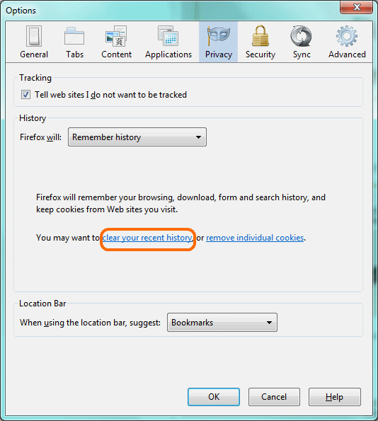
 5. Make sure **Time range to clear** is set to **Everything**.
 6. Tick **Cookies**.

  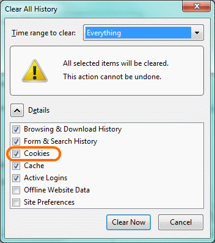
 7. Click **Clear now**.
 
In **Chrome**:
 1. Click the **Chrome menu**.
 2. Click **Tools**.
 3. Click **Clear browsing data**.
 4. Make sure **Obliterate the following items from** is set to **The beginning of time**.
 5. Tick **Delete cookies and other site and plug-in data**.
 6. Click **Clear browsing data**.
 
 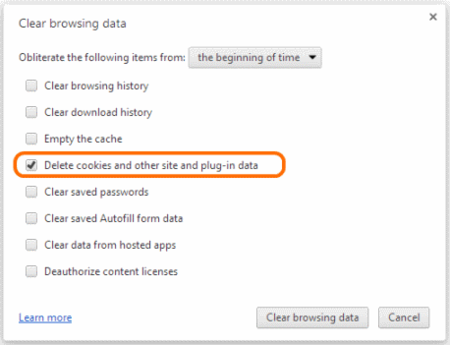

In **Internet Explorer**: 
 1. Click the **Tools** button (shaped like a gear).
 2. Click **Safety**.
 3. Click **Delete Browsing History**.
 4. Tick **Cookies**.
 5. Click **Delete**.
 
  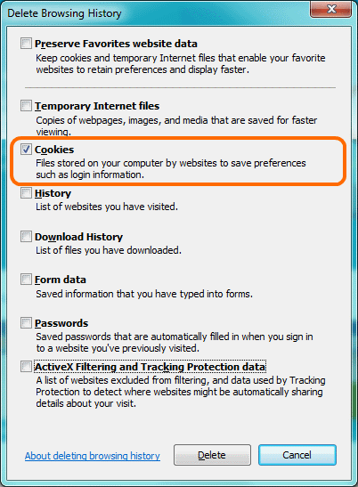

The limitation to this approach is that you will receive new cookies as soon as you return to these sites or go to any other pages with tracking components. The other disadvantage is that you will lose all of your current login sessions for any open tabs, forcing you to type in usernames and passwords again.  A more convenient option, supported by current browsers is private browsing or incognito mode. This opens a temporary browser window that does not save the history of pages viewed, passwords, downloaded files or cookies.  Upon closing the private browsing window, all of this information is deleted. You can enable private browsing:

In **Firefox**:
 1. Click the **Firefox menu**.
 2. Click **Start Private Browsing**.
 
 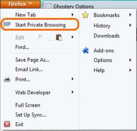
 3. If prompted, click **Start Private Browsing** again.
 
 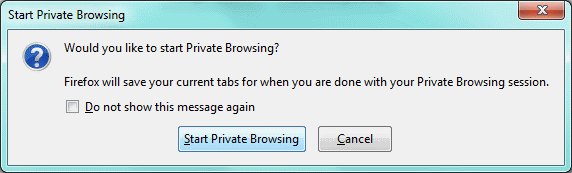
 4. The **Firefox menu** button turns purple, showing that private browsing is on.
 
 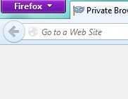

In **Chrome**:
 1. Click the **Chrome menu**.
 2. Click **New incognito window**.
 
  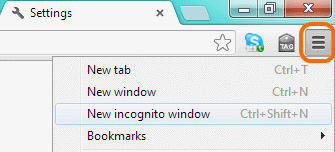
 3. The **spy icon** in the top-left of the browser window shows that private browsing is on.
 
  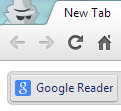
 
In **Internet Explorer**: 
 1. Click the **Tools** menu, shaped like a gear.
 2. Click **Safety**.
 3. Click **InPrivate Browsing**.
 
  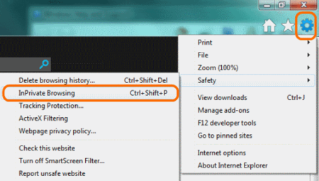 
 4. The **InPrivate** logo appears in the top-left of your browser window, showing that private browsing is on.
 
  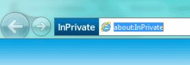

This solution also has its limitations. We cannot save bookmarks, remember passwords, or take advantage of much of the convenience offered by modern browsers. Thankfully, there are several plugins specially designed to address the problems of tracking. The most extensive, in terms of features and flexibility, is Ghostery. The plugin allows you to block categories or individual services that track users. Here's how you install Ghostery:

 1. In Firefox, click the **Firefox** menu and select **Add-ons**.
 
  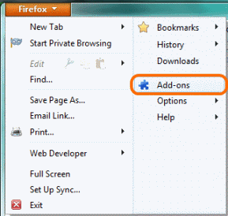
 2. In the **Search** box, type "ghostery", then click the **Search** icon or press **Enter**.
 
  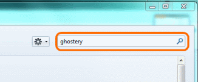
 3. Find Ghostery in the list of Add-ons, and click **Install**.
 
  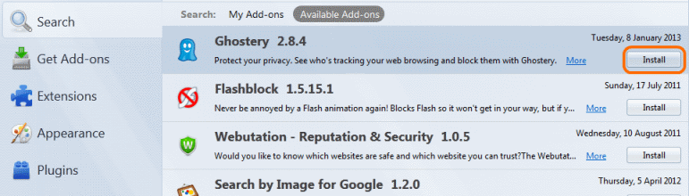
 4. Restart your browser by clicking **Restart Now**.
 
  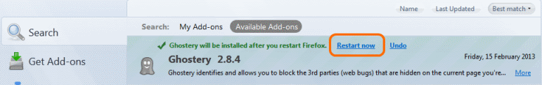
 5. Click the **Ghostery toolbar** and select **Options**. Do the walkthrough and/or play with Ghostery's settings, if you want.
 
  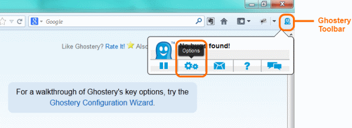
 6. Visit a web page and have a look at its trackers.
 
  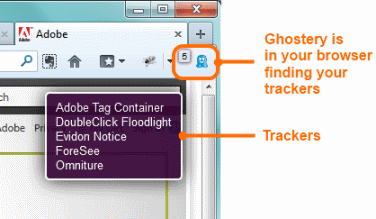

Another option is to install an ad-blocking plugin like AdBlockPlus. This will automatically block many of the tracking cookies sent by advertising companies but not those used by Google, Facebook and other web analytics companies.  [expand on this maybe, explain "web analytics"]

How can I see who is tracking me?

The easiest way to see who is tracking you is to use the Ghostery plugin. There is a small icon on the upper right or lower right corner of your browser window that will tell you which services are tracking you on particular web sites.

{Suggestion: Add Abine.com's Do Not Track add-on. I suggest using both Ghosterly and DNT, as occasionally they block a different cookie. Abine also has Privacy Suite, recently developed which can give a proxy telephone and proxy email, similar to 10 Minute Mail or Guerrilla Mail for fill- in emails for forms.}

A word of warning
-----------------

If you block trackers, you will have a higher level of privacy when surfing the net. However, government agencies, bosses, hackers and unscrupulous network administrators will still be able to intercept your traffic and see what you are looking at. If you want to secure your connections you will need to read the chapter on encryption. Your identity may also be visible to other people on the internet. If you want to thoroughly protect your identity while browsing, you will need to take steps toward online anonymity which is explained in another section of this book.
