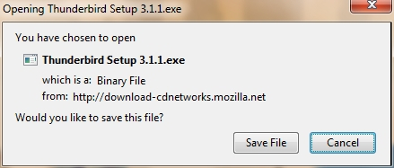
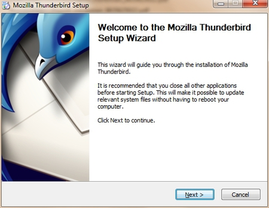
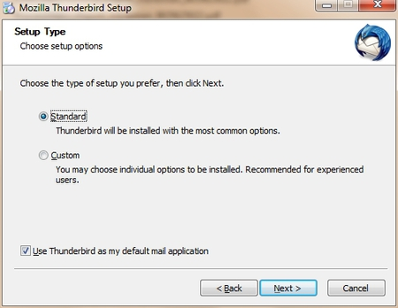
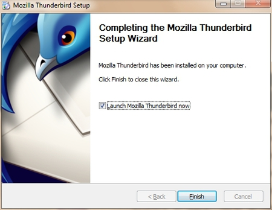
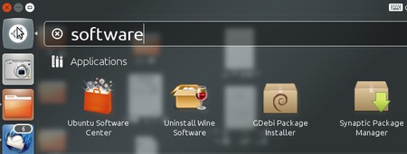
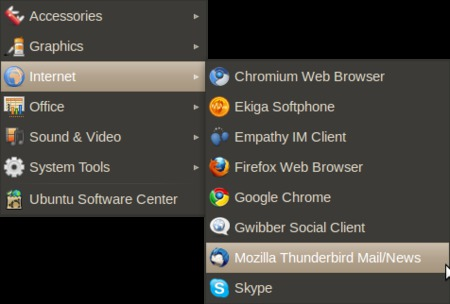
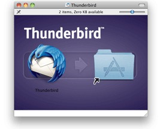
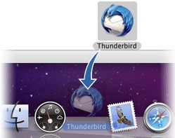
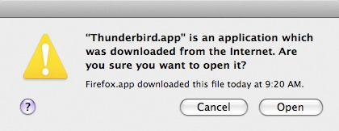

Start Using Thunderbird
=======================

In upcoming sections, we will be using Mozilla's Thunderbird e-mail program to show you how to configure your e-mail client for maximum security. Similar to Mozilla's Firefox browser, Thunderbird has many security advantages over its counterparts like Apple Mail and Outlook.

Thunderbird is a so-called "mail user agent" (MUA). This is different from web-based e-mail services like Google's Gmail. You must install the Thunderbird application on your computer. Thunderbird has a nice interface and features that enable you to manage multiple mailboxes, organize messages into folders, and search through mails easily.

Thunderbird can be configured to work with your existing e-mail account, whether that account is through your Internet Service Provider (such as Comcast) or through an web-based email provider (such as Gmail).

Using Thunderbird has many advantages over using web-based e-mail interfaces. These will be discussed in the following chapter. To summarize, though, Thunderbird enables much greater privacy and security than web-based e-mail services.

This section provides information on how to install Thunderbird on Windows, Mac OS X, and Ubuntu.

Installing Thunderbird on Windows
---------------------------------

Installing Thunderbird involves two steps: first, download the software and then run the installation program.

 1. Use your web browser to visit the Thunderbird download page at [http://www.mozillamessaging.com/en-US/thunderbird/](http://www.mozillamessaging.com/en-US/thunderbird/). This page detects your computer's operating system and language, and recommends the best version of Thunderbird for you to use.

 

 If you want to use Thunderbird in a different language or with a different operating system, click the *Other Systems and Languages* link on the right side of the page and select the version that you need.

 2. Click the download button to save the installation program to your computer.

 

 Click the **Save** button to save the Thunderbird Setup file to your computer.

 3. Close all applications running on your computer.
 4. Find the setup file on your computer (it's usually in the Downloads folder or on your desktop) and then double-click it to start the installation. The first thing that the installer does is display the **Welcome to the Mozilla Thunderbird Setup Wizard** screen.

 

 Click the **Next** button to start the installation. If you want to cancel it, click the **Cancel** button.

 5. The next thing that you see is the **Setup Type** screen. For most users the Standard setup option is good enough for their needs. The Custom setup option is recommended for experienced users only. Note that Thunderbird installs itself as your default mail application. If you do not want this, clear the checkbox labeled **Use Thunderbird as my default mail application**.

 

 Click the **Next** button to continue the installation.

 6. After Thunderbird has been installed, click the **Finish** button to close the setup wizard.

 

 If the **Launch Mozilla Thunderbird** now checkbox is selected, Thunderbird starts after it has been installed.

Installing Thunderbird on Ubuntu
--------------------------------

There are two different procedures for installing Thunderbird on Ubuntu: one for version 10.04 or later, and one for earlier versions of Ubuntu. We describe both below.

Thunderbird will not run without the following libraries or packages installed on your computer:

 * GTK+ 2.10 or higher
 * GLib 2.12 or higher
 * Pango 1.14 or higher
 * X.Org 1.0 or higher

Mozilla recommends that a Linux system also has the following libraries or packages installed:

 * NetworkManager 0.7 or higher
 * DBus 1.0 or higher
 * HAL 0.5.8 or higher
 * GNOME 2.16 or higher

Installing Thunderbird on Ubuntu 12.04 or newer
-----------------------------------------------

If you're using Ubuntu 12.04 or newer, the easiest way to install Thunderbird is through the Ubuntu Software Center.

 1. Type Software in the Untiy search window.

 

 2. Click on 'Ubuntu Software Center'
 3. Type "Thunderbird" in the search box and press the Enter on your keyboard. The Ubuntu Software Center finds Thunderbird in its list of available software.
 4. Click the **Install** button. If Thunderbird needs any additional libraries, the Ubuntu Software Center alerts you and installs them along with Thunderbird.

You can find the shortcut to start Thunderbird in the Internet option under the Applications menu:

Installing Thunderbird on Mac OS X
----------------------------------

To install Thunderbird on your Mac, follow these steps:

 1. Use your web browser to visit the Thunderbird download page at [http://www.mozillamessaging.com/en-US/thunderbird/](http://www.mozillamessaging.com/en-US/thunderbird/). This page detects your computer's operating system and language, and it recommends the best version of Thunderbird for you to use.

 

 2. Download the Thunderbird disk image. When the download is complete, the disk image may automatically open and mount a new volume called *Thunderbird*.

 If the volume did not mount automatically, open the Download folder and double-click the disk image to mount it. A Finder window appears:

 

 3. Drag the Thunderbird icon into your Applications folder. You've installed Thunderbird!
 4. Optionally, drag the Thunderbird icon from the Applications folder into the Dock. Choosing the Thunderbird icon from the Dock lets you quickly open Thunderbird from there.

 

**Note:** When you run Thunderbird for the first time, newer versions of Mac OS X (10.5 or later) will warn you that the application Thunderbird.app was downloaded from the Internet.

If you downloaded Thunderbird from the Mozilla site, click the **Open** button.

Starting Thunderbird for the first time
---------------------------------------

After you have installed Thunderbird for the first time you will be guided through the configuration of your mail account. These settings are defined by your e-mail provider (your Internet Service Provider or web-based e-mail service provider). The next chapter describes how to set up your account and configure it for maximum security.
