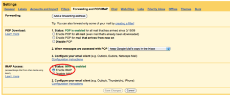
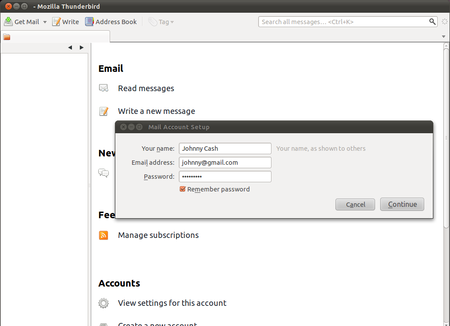
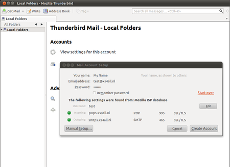
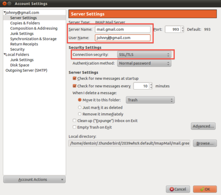
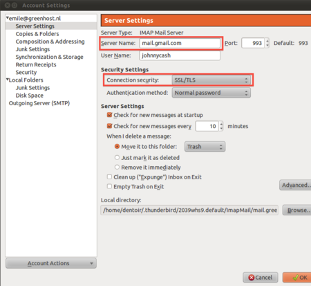
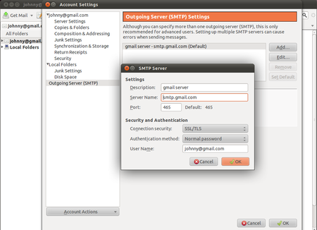

Setting up secure connections
=============================

There is a right (secure) way to configure your connection to your provider's mail servers and a wrong (insecure) way. The most fundamental aspect of e-mail security is the type of connection that you make to your e-mail provider's mail server.

Whenever possible, you should connect using the **SSL** (Secure Socket Layer) and **TLS** (Transport Layer Security) protocols. (**STARTTLS**, which is another option available when configuring an account, is a variation of SSL / TLS.) These protocols prevent your own system (beyond Thunderbird) and any points between your system and the mail server from intercepting and obtaining your password. SSL / TLS also prevent eavesdroppers from reading the content of your messages.

These protocols, however, only secure the connection between your computer and the mail server. They do not secure the information channel all the way to the message recipient. Once the mail servers forward the message for delivery, the message may be intercepted and read by points in between the mail server and the recipient.

This is where **PGP** (Pretty Good Privacy) comes in, which is described in the next chapter.

The first step in establishing e-mail security is a secure connection between your system and the mail servers. This chapter describes how to set up your e-mail account the right way.

Configuration requirements
--------------------------

When you configure an account, Thunderbird attempts to determine (from the email account and the account details that you provide) the connection parameters to your email provider. While Thunderbird knows the connection parameters for many email providers, it does not know them all. If the parameters are not known to Thunderbird, you will need to provide the following information to configure your account:

 * **Your username**
 * **Your password**
 * **Incoming server:** name (such as `imap.example.com`), protocol (POP or IMAP), port (by default, 110), and security protocol
 * **Outgoing server:** name (such as `smtp.example.com`), port (by default, 25), and  security protocol

You should have received this information from your hosting provider. Alternatively, you can usually find this information on the support pages on the website of your hosting provider. In our example we will be using the Gmail server configuration. You can use Thunderbird with your Gmail account. To do so, you must change a configuration setting in your account. If you are not using a Gmail account, skip the next section.

Preparing a Gmail account for use with Thunderbird
--------------------------------------------------

Log in to your Gmail account in your browser. Select **Settings** from options in the top right, then go to the tab **Forwarding and POP/IMAP**. Click **Enable IMAP** and then **Save Changes**.

Configuring Thunderbird to use SSL/TLS
--------------------------------------

When you start up Thunderbird for the first time, you will enter a step-by-step configuration procedure for setting up your first account. (You can invoke the account setup interface any time by selecting **File | New | Mail Account**). On the first screen, you will be asked for your name, your email-address and your password. The value you enter for your name does not have to be your real name. It will be shown to the recipient of your messages. Enter the information and click **Continue**.

On the next screen, Thunderbird will attempt to determine the server names based on your email address. This may take some time, and will only work if Thunderbird knows the settings for the mail servers for your email provider. In either case you will be presented with a window where you can modify the settings. In the example below, Thunderbird has detected the settings automatically. You can see the protocol at the right side of the server names. This should be either **SSL/TLS** or **STARTTLS**. *Otherwise your connection is insecure and you should attempt manual setup.*

When you are finished, click **Create account**. If Thunderbird could not determine your server settings, click on **Manual setup** to configure the server names yourself.

Manual setup
------------

Use the Account Settings interface to manually configure accounts in Thunderbird. The Account Settings dialog will automatically open if you select **Manual setup** in the configuration wizard. In this case we are only interested in the incoming and outgoing mail server names, and the protocol we use to connect with them. As you can see in the examples below, we enter the Gmail server names and we force them to use **TLS/SSL**, a secure method to connect to the servers.

Under 'Server Settings', we will find only the incoming (**IMAP**) server and its settings for that specific account.

After **Server Name** enter the name of the IMAP server, in this case `mail.gmail.com`.

*As you can see we have selected **'SSL/TLS'** under the connection security setting. This enforces encryption.* Do not be scared by the authentication method **Normal password**. The password will be automatically encrypted due to our secured connections to the server.

Finally, configure the outgoing server for the account. Click on **Outgoing Server (SMTP)** in the left panel.

Again, we have selected **SSL/TLS** under **Connection security**. The port will default to 465 and this should generally not have to be changed.

Finishing the setup, different encryption methods
-------------------------------------------------

Test your Thunderbird setup by trying to send and receive mails. Some email hosting providers may not support the SSL/TLS protocol, which is the preferred choice. You will get an error message saying the authentication protocol is not supported by the server. You may then switch to using STARTTLS instead. In the above two screens, select 'STARTTLS' under 'Connection security'. If this method also fails, contact your email hosting provider and ask them if they provide another way to securely connect to their servers. If they do not allow you to securely connect to their servers, then you should complain and seriously consider switching to a different provider.

Returning to the configuration screens
--------------------------------------

At any time you can reconfigure your email accounts by going to the Thunderbird menu bar and clicking **Edit | Account Settings** (Linux), **Tools | Account Settings** (Windows and Mac OS X).
