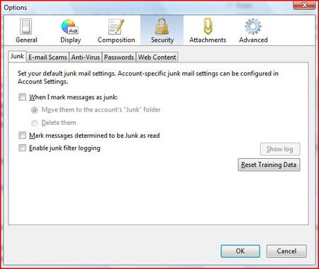
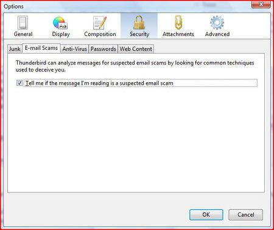
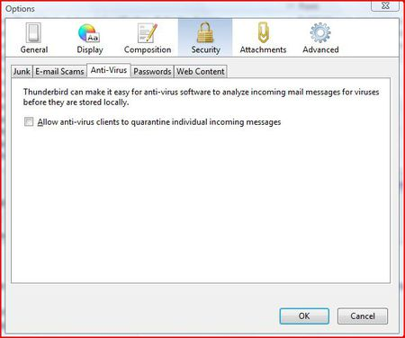
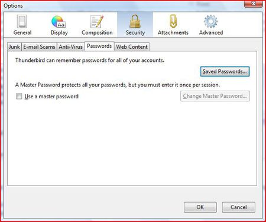
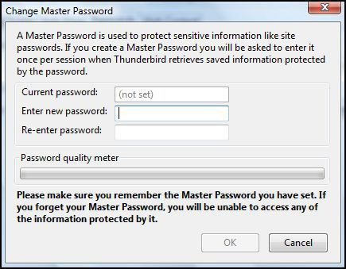
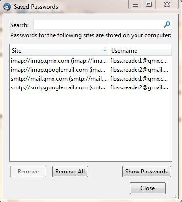
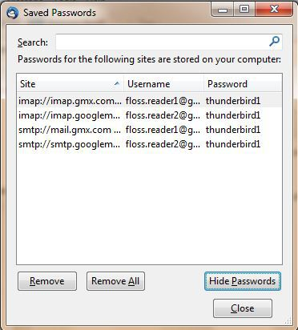
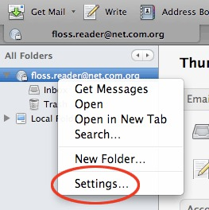
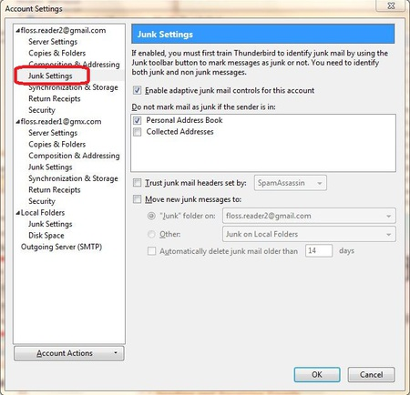

Some Additional Security Settings
=================================

Thunderbird provides additional security measures to protect you from junk mail, identity theft, viruses (with the help of your anti-virus software, of course), intellectual property theft, and malicious web sites.

We will look at the following Thunderbird security features. First a little background on why you need to consider some of these measures:

 * **Adaptive junk mail controls**. Adaptive junk mail controls allow you to train Thunderbird to identify junk email (SPAM) and remove it from your inbox. You can also mark messages as junk mail manually if your email provider's system misses the junk mail and lets it go through.
 * **Integration with anti-virus software.** If your anti-virus software supports Thunderbird, you can use that software to quarantine messages that contain viruses or other malicious content. If you're wondering what anti-virus software works with Thunderbird, you can find a list here: [http://kb.mozillazine.org/Antivirus_software](http://kb.mozillazine.org/Antivirus_software).
 * **Master password.** For your convenience, you can have Thunderbird remember each of your individual passwords of your e-mail accounts. You can specify a master password that you enter each time you start Thunderbird. This will enable Thunderbird to open all your email accounts with your saved passwords.
 * **Restrictions on cookies.** Some blogs and websites attempt to send cookies (a piece of text that stores information from Web sites on your computer) with their RSS feeds. These cookies are often used by content providers to provide targeted advertising. Thunderbird rejects cookies by default, but you can configure Thunderbird to accept some or all cookies.

In the Security Preferences section of Thunderbird's Options/Preferences dialog box you can set up the preferences for these features.

 * In Windows and Mac OS X, go to the 'Tools' menu and click 'Options'.
 * On Ubuntu or other versions of Linux, go to the 'Edit' menu and click 'Preferences'.

Junk mail settings
------------------

 1. In the Preferences/Options dialog box, click 'Security' and then click the 'Junk' tab.

 

 2. Do the following:
    * To tell Thunderbird that it should handle messages marked as junk, select the check box labelled 'When I mark message as junk'.
    * To have Thunderbird move these messages to a junk folder, select the 'Move them to account's 'Junk' folder' radio button.
    * To have Thunderbird delete junk mail upon receiving it, select the 'Delete them' radio button.

 3. Thunderbird will mark junk message as read if you select the check box labeled 'Mark messages determined to be Junk as read'.
 4. If you want to keep a log of junk mail received, select the 'Enable junk filter logging' check box.
 5. Click the 'OK' button to close the 'Options/Preferences' dialog box.

Scam detection and warning system
---------------------------------

 1. In the Preferences/Options dialog box, click 'Security' and then click the 'E-mail Scams' tab.

 

 2. To have Thunderbird warn you about possible email scams, select the check box labelled 'Tell me if the message I'm read is a suspected email scam'. To turn off this feature, deselect this check box.

 3. Click the 'OK' button to close the 'Options/Preferences' dialog box.

Anti-virus integration
----------------------

 1. In the Preferences/Options dialog box, click 'Security' and then click the 'Anti-Virus' tab.

 

 2. To turn on anti-virus integration, select the check box labeled 'Allow anti-virus clients to quarantine individual incoming messages'. To turn off this feature, deselect this check box.
 3. Click the 'OK' button to close the 'Options/Preferences' dialog box.

Set a master password
---------------------

 1. In the Preferences/Options dialog box, click 'Security' and then click the 'Passwords' tab.

 

 2. Select the check box labeled 'Use a master password'.
 3. Enter your password into the 'Enter new password' and 'Re-enter password' fields.

 

 4. Click the 'OK' button to close the Change Master Password dialog box.
 5. If you want to see the passwords that you have saved in Thunderbird, click the 'Saved Passwords' button. This will open the 'Saved Passwords' dialog box.

 

 6. To see the passwords, click the 'Show Passwords' button.

 

 7. Click the 'Close' button to close 'Saved Passwords' dialog box.
 8. Click the 'OK' button to close the 'Options/Preferences' dialog box.

Adaptive junk mail controls
---------------------------

You need to first open Account Settings window. Note that settings configured in the Account Settings window apply only to the account that you select in the Folders pane. You must configure local folders separately.

 1. In the Folders pane right-click on an account name and select 'Settings'.

 

 2. In Windows or Mac go to the 'Tools' menu and select 'Account Settings'. In Linux, go to the 'Edit menu' and select 'Account Settings'.

 3. To set adaptive junk mail controls for a specific account, pick an account and click 'Junk Settings'.

 

 4. To turn on the controls, select the check box labeled 'Enable adaptive junk mail controls for this account'. To turn them off, deselect this check box.
 5. If you want the controls to ignore mail from senders in your Address Book, select the check boxes next to any of the listed address books.
 6. To use a mail filter such as SpamAssassin or SpamPal, select the check box labelled 'Trust junk mail headers sent by:' and pick a filter from the menu.
 7. Select the check box labeled 'Move new junk messages to' if you want to move junk mail to a specified folder. Then select the destination folder to be either at your email provider or a local folder on your computer.
 8. Select the 'Automatically delete junk mail other 14 days' check box to have Thunderbird regularly remove junk mail. To change the time period for this process, enter a different number (in days) in the text box.
 9. Click 'OK' to save your changes.
 
