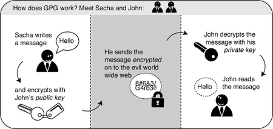

Introducing mail encryption (PGP)
=================================

This chapter will introduce you to some basic concepts behind mail encryption. It is important to read to get some feeling of how mail encryption actually works and what its caveats and limitations are. **PGP** (Pretty Good Privacy) is the protocol we shall use for e-mail encryption. This protocol allows us to digitally sign and encrypt mail messages. It works on an end-to-end basis: messages will be encrypted on your own computer and will only be decrypted by the recipient of the message. There is no possibility for a 'man-in-the-middle' to decipher the contents of your encrypted message. This *excludes* the subject lines and the 'from' and 'to' addresses, which unfortunately are not encrypted in this protocol.

After having introduced these basic concepts, the next chapters will give you a hands-on guide to install the necessary tools on your operating system and get encryption up and running. We will focus on using Enigmail which is an extension for Thunderbird that helps you manage PGP encryption for your email. The installation process for Enigmail / PGP is different for Mac OSX, Windows and Ubuntu so please see the appropriate chapters in this section for instructions.

Using a key-pair to encrypt your mail
-------------------------------------

A crucial concept in mail encryption is the usage of so-called *key-pairs*. A key-pair is just two separate files sitting on your harddisk or USB stick. Whenever you want to encrypt mails for a certain mail-account, you will need to have these files available to yourself in some form. If they are sitting at home on your computer, you will not be able to decrypt mail at the office. Putting them on a USB stick should provide a solution to this problem.

A key-pair consists of the two different keys: a public key and a secret key.

The public key: you can give this key to other people, so they can send you encrypted mails. This file does not have to be kept secret.

The secret key: this basically is your secret file to decrypt emails people send to you. It should *never* be given to someone else.

Sending encrypted mails to other people: you need their public key
------------------------------------------------------------------

I have five colleagues at work and I want to send encrypted mails to them. I need to have public keys for each of their addresses. They can send me these keys using ordinary mail, or they can give them to me in person, or put them on a USB stick, or they can have their keys on a website. It doesn't matter, as long as I can trust those keys really belong to the person I want to correspond with. My software puts the keys on my `keyring', so my mail application knows how to send them encrypted mails.

Receiving encrypted mails from other people: they need my public key
--------------------------------------------------------------------

For my five (or thirty) colleagues to be able to send *me* encrypted mails, the process goes the other way around. I need to distribute my public key to each of them.

Conclusion: encryption requires public key distribution!
--------------------------------------------------------

All the people in a network of friends or colleagues wanting to send each other encrypted emails, need to distribute their public keys to each other, while keeping their secret keys a closely guarded secret. The software described in this chapter will help you do this key management.