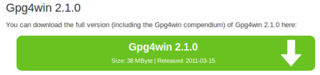
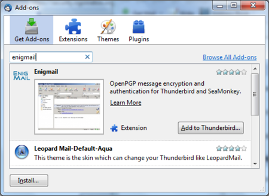
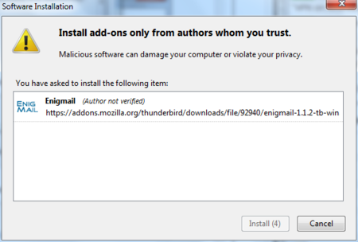
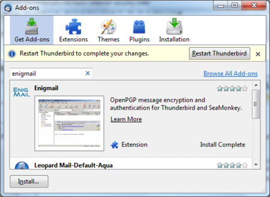

Installing PGP on Windows
=========================

To complicate matters a little - PGP is the protocol used for encrypting e-mail by various softwares. To get PGP to work with Thunderbird we need to install GPG - a free software implementation of PGP *and* Enigmail - an extension of Thunderbird that allows you to use GPG... Confused?! Don't worry about it, all you have to know is how to encrypt your email with PGP and you need to install *both* GPG and Enigmail. Here is how to do it...

Installing PGP (GPG) on Microsoft Windows
-----------------------------------------

The GNU Privacy Guard (GnuPG) is software which is required to send PGP encrypted or signed emails. It is necessary to install this software before being able to do any encryption.

Head to the website of the Gpg4win project. Go to [http://gpg4win.org/](http://gpg4win.org/)

On the left side of the website, you will find a 'Download' link. Click on it.

This will take you to a page where you can download the Gpg4Win. Click on the button which offers you the latest stable version (not beta) of Gpg4Win.

This will download you an .exe file. Depending on your browser, you may have to double-click on this downloaded file (named something like `gpg4qin-2.1.0.exe`) before something happens. Windows will ask you if you are sure you want to install this program. Answer yes.

Then complete the installation by agreeing to the license, choosing appropriate language and accepting the default options by clicking 'Next', unless you have a particular reason not to. 

The installer will ask you where to put the application on your computer. The default setting should be fine but make a note of it as we may need this later. Click on 'Next' when you agree.
 
Installing with the Enigmail extension
--------------------------------------

After you have successfully installed the **PGP** software as we described above you are now ready to install the **Enigmail** add-on.

Enigmail is a Thunderbird add-on that lets you protect the privacy of your email conversations. Enigmail is simply an interface that lets you use PGP encryption from within Thunderbird.

Enigmail is based on public-key cryptography. In this method, each individual must generate her/his own personal key pair. The first key is known as the private key. It is protected by a password or passphrase, guarded and never shared with anyone.

The second key is known as the public key. This key can be shared with any of your correspondents. Once you have a correspondent's public key you can begin sending encrypted e-mails to this person. Only she will be able to decrypt and read your emails, because she is the only person who has access to the matching private key.

Similarly, if you send a copy of your own public key to your e-mail contacts and keep the matching private key secret, only you will be able to read encrypted messages from those contacts.

Enigmail also lets you attach digital signatures to your messages. The recipient of your message who has a genuine copy of your public key will be able to verify that the e-mail comes from you, and that its content was not tampered with on the way. Similarly, if you have a correspondent's public key, you can verify the digital signatures on her messages.

Installation steps
------------------

To begin installing Enigmail, perform the following steps:

 1. Open **Thunderbird**, then `Select Tools > Add-ons` to activate the *Add-ons* window; the Add-ons window will appear with the default *Get Add-ons* pane enabled.

 2. Enter enigmail in the search bar, like below, and click on the search icon.

 

 3. Simply click on the 'Add to Thunderbird' button to start the installation.

 4. Thunderbird will ask you if you are certain you want to install this add-on. We trust this application so we should click on the 'Install now' button.

 

 5. After some time the installation should be completed and the following window should appear. Please click on the 'Restart Thunderbird' button.

 
