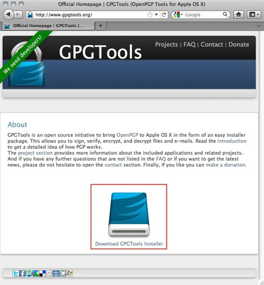
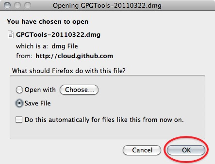
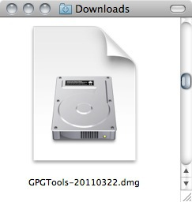
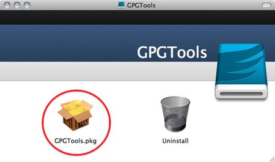
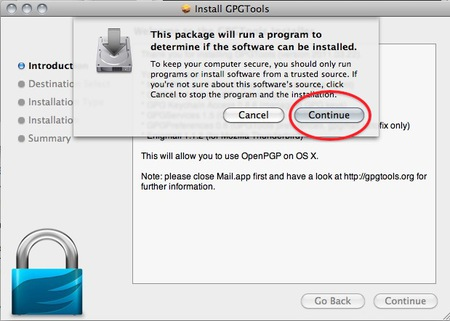
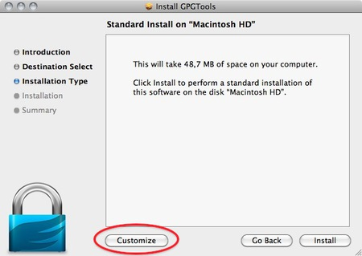
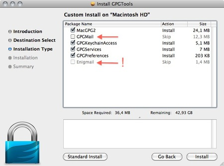
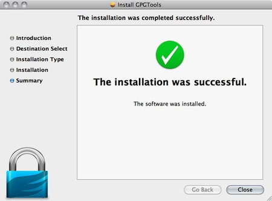
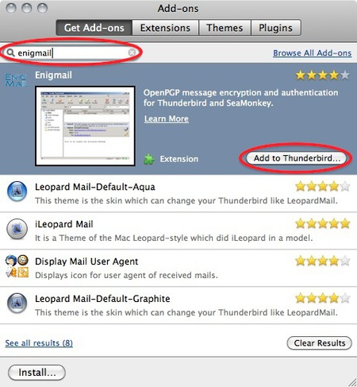
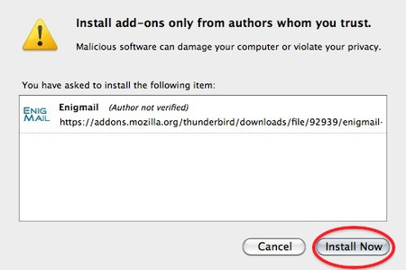

Installing PGP on OSX
=====================

The GNU Privacy Guard (GnuPG) is software which enables you to send PGP encrypted or signed emails. It is necessary to install this software before being able to do any encryption. This chapter covers the installation steps required to install GnuPG on Mac OSX.

Getting started
---------------

For this chapter we assume you have the latest version of:

 * OSX installed (10.6.7)
 * Thunderbird (3.1.10)

 **Note on OSX Mail:** It is possible to use PGP with the build-in mail program of OSX. But we do not recommend this because this option relies on a hack of the program which is neither open or supported by its developer and breaks with every update of the mail program. So unless you really have no other option we advice you to switch to Mozilla Thunderbird as your default mail program if you want to use PGP.

Downloading and installing the Software
---------------------------------------

 1. For OSX there is a bundle available which will install everything you need in one installation. You can get it by directing your browser to [http://www.gpgtools.org/](http://www.gpgtools.org/) and clicking on the big blue disk with "Download GPGTools Installer" written under it. It will redirect you to another page on [http://www.gpgtools.org/installer/index.html](http://www.gpgtools.org/installer/index.html) where you can actually download the software.

*(nb. We are using the latest version Firefox for this manual, so the screens might look a little bit different if you are using a different browser)*

 2. Download the software by choosing 'Save File' and clicking 'OK' in the dialogue.

 

 3. Navigate to the folder where you normally store your downloads (Mostly the desktop or the downloads folder surprisingly) en double click the '.DMG' file to open the virtual disk containing the installer.

 

 4. Open the installer by double-clicking on the icon.

 

 5. The program will check your computer to see if it can run on the computer.

 (Note, if you're Mac is bought before 2006 it will not have an intel processor required to run this software and the installation will fail. Sadly it is beyond the scope op this manual to also take into account computers over five year old)

 

 You will be guided by the program through the next steps like accepting the license agreement. But stop pressing all the OK's and Agrees as soon as you come to the 'Installation Type' screen:

 

 6. Clicking 'Customize' will open this screen where you several options of programs and software to install. You can click on each one of them to get a little bit of information on what is is, what it does and why you might need it.

 

As said in the intro; we advise against using Apple Mail in combination with PGP. Therefore you won't be needing 'GPGMail', as this enables PGP on Apple Mail, and you can uncheck it.

'**Enigmail**' on the other hand is very important as it is the component that will enable Thunderbird to use PGP. In the screen shot here it is greyed out as the installer wasn't able to identify my installation of Thunderbird. Since this seems to be a bug. You can also install Enigmail from within Thunderbird as is explained in another chapter.

If the option is not greyed out in your installation, you should tick it.

After you checked all the components you want to install click 'Install' to proceed. The installer will ask you for your password and after you enter that the installation will run and complete; Hooray!

Installing up Engimail
----------------------

 1. Open **Thunderbird**, then `Select Tools > Add-ons` to activate the *Add-ons* window; the Add-ons window will appear with the default *Get Add-ons* pane enabled.

 In the Add-On window, you can search for 'Enigmail' and install the extension by clicking 'Add to Thunderbird ...'

 2. After you open the Add-On window, you can search for 'Enigmail' and install the extension by clicking 'Add to Thunderbird ...'

 

 3. Click on 'Install Now' to download and install the extension.

 

**Be aware that you will have to restart Thunderbird to use the functionality of this extension!**

Now that you have successfully downloaded and installed Enigmail and PGP you can go on to the Chapter that deals with setting up the software for use.