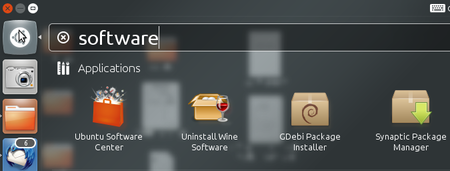
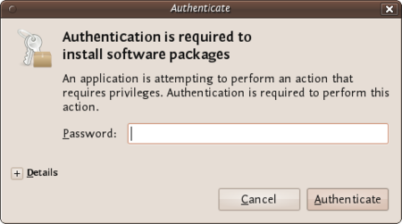

Installing PGP on Ubuntu
========================

We will use the Ubuntu Software Centre for installing PGP (Enigmail and accessories). First open the Ubuntu Software Center through the Unity menu by typing 'software' into the Unity search area

Click on the 'Ubuntu Software Center'.

Type into the search field 'Enigmail' and search results should be returned automatically:

Highlight the Enigmail item (it should be highlighted by default) and click 'Install' and you will be asked to authenticate the installation process.

Enter your password and click 'Authenticate'. The installation process will begin.

When the process is completed you get very little feedback from Ubuntu. The progress bar at the top left disappears. The 'In Progress' text on the right also disappears. Enigmail should now be installed.
