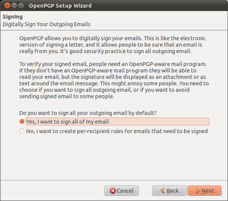
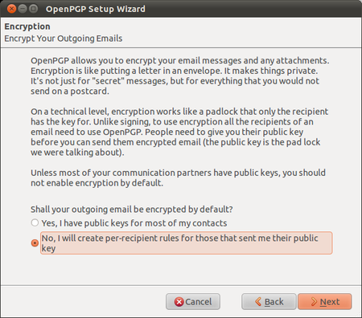
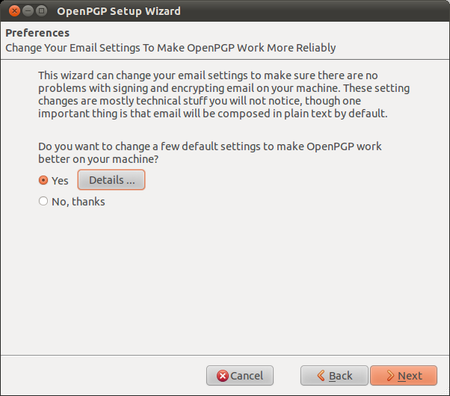
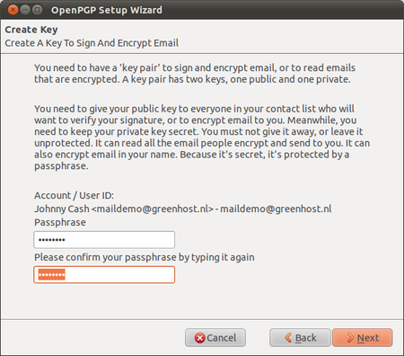
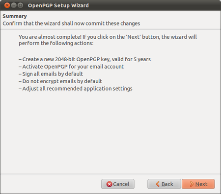
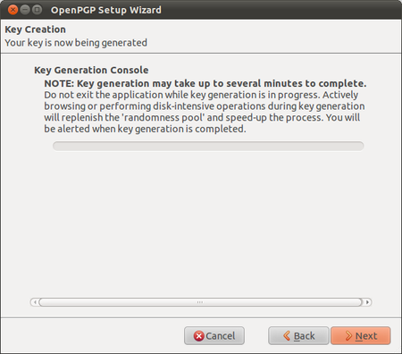
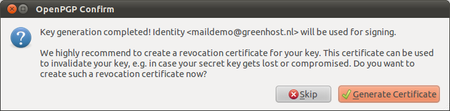
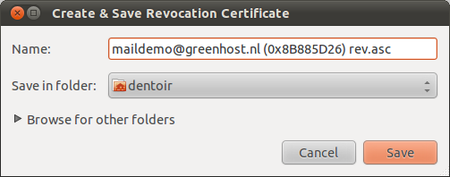
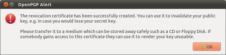
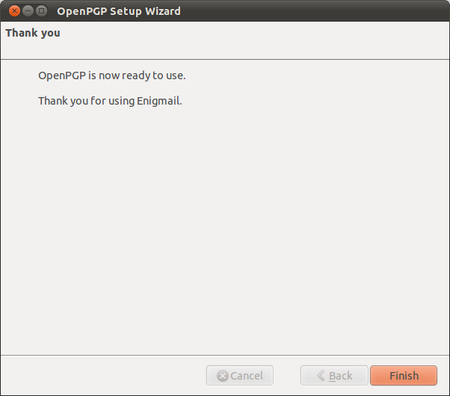

Creating your PGP keys
======================

Enigmail comes with a nice wizard to help you create a public/private key pair (see the chapter introducing PGP for an explanation). You can start the wizard at any time within Thunderbird by selecting `OpenPGP > Setup Wizard` from the menu on top.

 1. This is what the wizard looks like. Please read the text on every window carefully. It provides useful information and helps you setup PGP to your personal preferences. In the first screen, click on Next to start the configuration.

 

 2. The wizard asks you whether you want to sign all your outgoing mail messages. Signing all your messages is a good choice. If you choose not to, you can still manually decide to sign a message when you are composing it. Click on the 'Next' button after you have made a decision.

 

 3. On the following screen, the wizard asks you whether you want to encrypt *all* your outgoing mail messages. Unlike signing of mails, encryption requires the recipient to have PGP software installed. You should probably answer 'no' to this question, so that you will send normal (unencrypted) mail by default. After you have made your decision, click on the 'Next' button.

 

 4. On the following screen the wizard asks if it can change some of your mail formatting settings to better work with PGP. It is a good choice to answer 'Yes' here. This will mean that by default, mail will be composed in plain text rather than HTML. Click on the 'Next' button after you have made your decision.

 

 5. In the following screen, select one of your mail accounts; the default is selected for you if you only have one. In the 'Passphrase' text box you must enter a password. This is a *new* password which is used to protect your private key. It is **very important** to remember this password, because you cannot read your own encrypted emails if you forget it. Make it a **strong** password, ideally 20 characters or longer. Please see the chapter on passwords for help on creating unique, long and easy to remember passwords. After you have selected your account and created a passphrase, click on the 'Next' button.

 

 6. In the following screen the wizard summarizes the actions it will take to enable PGP encryption for your account. If you are satisfied, click the 'Next' button.

 

 7. Your keys will be created by the wizard, which will take some time. When completed, click on the 'Next' button.

 

 8. You now have your own PGP key-pair. The wizard will ask you if you also want to create a 'Revocation certificate'. This is a file which can be used to inform everyone if your private key is compromised, for example if your laptop is stolen. Think of it as a 'kill switch' for your PGP identity. You may also wish to revoke the key simply because you have generated a new one, and the old one is obsolete.

 

 9. If you decided to generate a revocation certificate, the wizard will ask you where the file should be saved. The dialog will look different depending on which operating system you use. It is a good idea to rename the file to something sensible like my_revocation_certificate. Click on 'Save' when you you have decided on a location.

 

 10. If you decided to generate a revocation certificate, the wizard informs you it has been successfully stored. You may want to print it out or burn it to a CD and keep it in a safe place.

 

 11. The wizard will inform you it has completed.

 

Congratulations, you now have a fully PGP-configured mail client. In the next chapter we will explain how to manage your keys, sign messages and do encryption. Thunderbird can help you do a lot of these things automatically.