Daily PGP usage
===============

In the previous chapters we have have explained how to set up a secure mail environment using Thunderbird, GPG and Enigmail. We assume you have installed the software and have successfully followed the wizard instructions to generate an encryption key-pair as described in the previous chapter. This chapter will describe how to use your secured Thunderbird in daily life to protect your e-mail communication. In particular we will focus on:

 1. Encrypting attachments
 2. Entering your pass-phrase
 3. Receiving encrypted e-mail
 4. Sending and receiving public keys
 5. Receiving public keys and adding them to your key ring
 6. Using public key servers
 7. Signing e-mails to an individual
 8. Sending encrypted e-mails to an individual
 9. Automating encryption to certain recipients
 10. Verifying incoming e-mails
 11. Revoking your GPG key pair
 12. What to do when you have lost your secret key, or forgot your passphrase
 13. What to do when your secret key has been stolen, or compromised
 14. Backing up your keys

First we shall explain two dialog windows that will inevitably appear after you start using Thunderbird to encrypt your emails.

Encrypting attachments
----------------------

The dialog window below will pop-up whenever you are sending an encrypted email with attachments for the first time. Thunderbird asks a technical question on how to encrypt attachments to your mail. The second (default) option is the best choice, because it combines security with the highest compatibility. You should also select the 'Use the selected method for all future attachments' option. Then click 'OK' and your mail should be sent with no further delay.

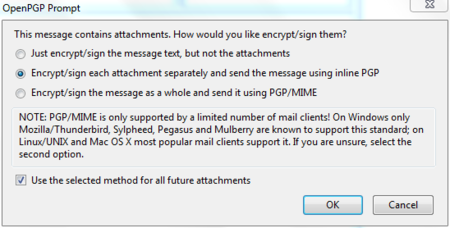

Entering your pass-phrase
-------------------------

For security reasons, the pass-phrase to your secret key is stored temporarily in memory. Every now and then the dialog window below will pop-up. Thunderbird asks you for the pass-phrase to your secret key. This should be different from your normal email password. It was the pass-phrase you have entered when creating your key-pair in the previous chapter. Enter the pass-phrase in the text-box and click on 'OK'

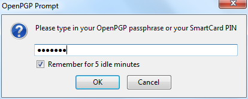

Receiving encrypted e-mails
---------------------------

The decryption of e-mails is handled automatically by Enigmail, the only action that may be needed on your behalf is to enter the pass-phrase to your secret key. However, in order to have any kind of encrypted correspondence with somebody, you will first need to exchange public keys.

Sending and receiving public keys
---------------------------------

There are multiple ways to distribute your public key to friends or colleagues. By far the simplest way is to attach the key to a mail. In order for your friend to be able to trust that the message actually came from you, you should inform them in person (if possible) and also require them to reply to your mail. This should at least prevent easy forgeries. You have to decide for yourself what level of validation is necessary. This is also true when receiving emails from third-parties containing public keys. Contact your correspondent through some means of communication other than e-mail. You can use a telephone, text messages, Voice over Internet Protocol (VoIP) or any other method, but you must be absolutely certain that you are really talking to the right person. As a result, telephone conversations and face-to-face meetings work best, if they are convenient and if they can be arranged safely.

Sending your public key is easy.

 1. In Thunderbird, click on the  icon.

 2. Compose a mail to your friend or colleague and tell them you are sending them your PGP public key. If your friend does not know what that means, you may have to explain them and point them to this documentation.

 3. Before actually sending the mail, click to `OpenPGP > Attach My Public Key` option on the menu bar of the mail compose window. Next to this option a marked sign will appear. See the example below.

 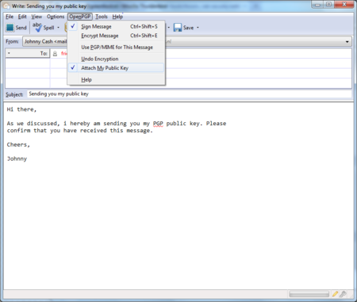

 4. Send your mail by clicking on the 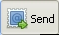 button.

Receiving public keys and adding them to your keyring
-----------------------------------------------------

Lets say we receive a public key from a friend by mail. The key will show up in Thunderbird as an *attached file*. Scroll down the message and below you will find tabs with one or two file names. The extension of this public key file will be .asc, different from the extension of an attached GPG signature, which ends with .asc.sig

Look at the example email in the next image, which is a received, signed GPG message containing an attached public key. We notice a yellow bar with a warning message: 'OpenPGP: Unverified signature, click on 'Details' button for more information'. Thunderbird warns us that the sender is not known yet, which is correct. This will change once we have accepted the public key.

What are all those strange characters doing in the mail message? Because Thunderbird does not yet recognize the signature as valid, it prints out the entire raw signature, just as it has received it. This is how digitally signed GPG messages will appear to those recipients who do not have your public key.

The most important thing in this example is to find the attached GPG public key. We mentioned it is a file that ends with .asc. In this example it's the first attachment on the left, in the red circle. Double-clicking on this attachment will make Thunderbird recognize the key.

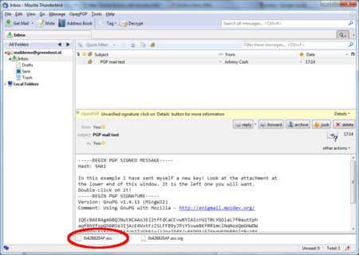

After we have clicked on the attachment, the following pop-up will appear.

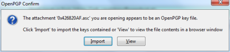

Thunderbird has recognized the GPG public key file. Click on 'Import' to add this key to your keyring. The following pop-up should appear. Thunderbird says the operation was successful. Click on 'OK' and you are almost done.

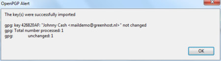

We are back in the main Thunderbird screen and we refresh the view on this particular example message, by clicking on some other message and back for example. Now the body of the message looks different (see below). This time Thunderbird *does* recognize the signature, because we have added the public key of the sender.

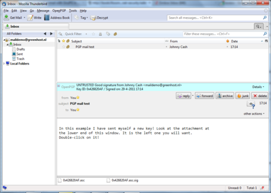

There is still one thing that remains. While Thunderbird now recognizes the signature, we should explicitly trust that the public key really belongs to the sender in real life. We realize this when we take a closer look at the green bar (see below). While the signature is good, it is still UNTRUSTED.

We will now decide to trust this particular public key and the signatures made by it. We can do this immediately by clicking on 'Details'. A small menu will appear (see below). From this menu we should click on the option 'Sign Sender's Key ...'.

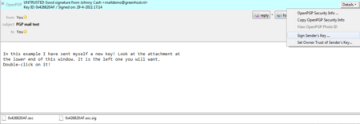

After we have selected 'Sign Sender's Key ...' we will get another selection window (see below). We are requested to state how carefully we have checked this key for validity. The explanation of levels of trust and trust networks in GPG falls outside the scope of this document. We will not use this information, therefore we will just select the option 'I will not answer'. Also select the option 'Local signature (cannot be exported)'. Click on the 'OK' button to finishing signing this key. This finishes accepting the public key. You can now send encrypted mail to this individual.

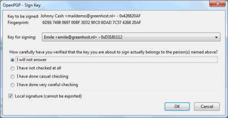

Using public key servers
------------------------

Another method of distributing public keys is by putting them on a public key server. This allows anyone to check whether your email address has GPG support, and then download your public key.

To put your own key on a keyserver, take the following steps.

 1. Head to the key manager by using the Thunderbird menu and click on `OpenPGP > Key Management`

 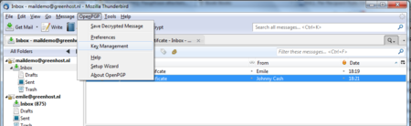

 2. The key management window will be displayed and looks like this:

 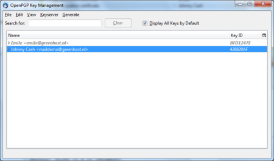

 3. You need to have selected the 'Display All Keys by Default' option to get a list of all your keys. Look up your own email address in the list and right click on the address. A selection window will appear with some options. Select the option 'Upload Public Keys to Keyserver'.

 

 4. You will see a small dialog window like below. The default server to distribute your keys to is good. Press 'OK" and distribute your public key to the world.

 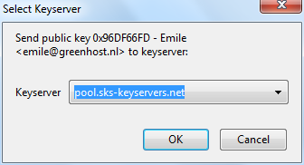

To look up whether some email address has a public key available on a server, take the following steps.

 1. Head to the key manager by using the Thunderbird menu and click on `OpenPGP > Key Management`

 2. In the key manager window menu bar, select `Keyserver > Search for Keys`

 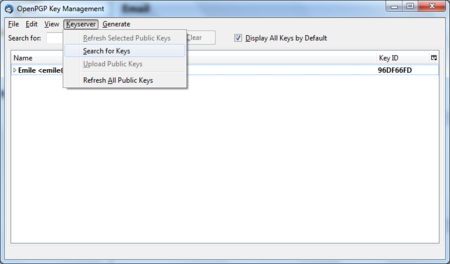

 3. In this example we will look-up up the key for the creator of PGP software, Philip Zimmermann. After we have entered the email address, we click on 'OK'.

 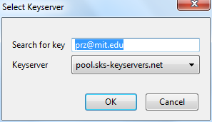

 4. The next window displays the result of our search. We have found the public key. It is automatically selected. Just click on 'OK' to import the key.

 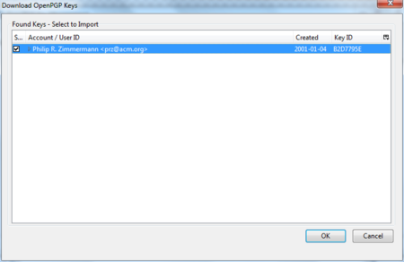

 5. Importing the key will take some time. On completion you should see a pop-up window like below.

 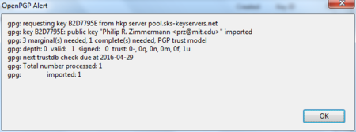

 6. The final step is to locally sign this key, to indicate that we trust it. When you are back in the key manager, make sure you have selected the 'Display All Keys by Default' option. You should now see the newly imported key in the list. Right-click on the address and select the option 'Sign Key' from the list.

 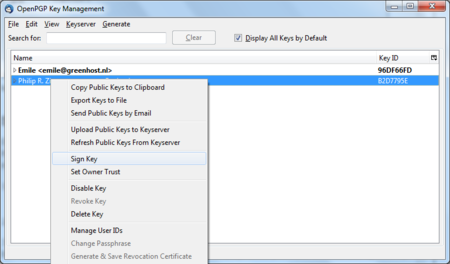

 7. Select the options 'I will not answer' and 'Local signature (cannot be exported)', then click on 'OK'. You are now finished and can send Philip Zimmermann encrypted mail.

 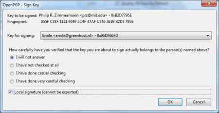

Signing emails to an individual
-------------------------------

Digitally signing email messages is a way to prove to recipients that you are the actual sender of a mail message. Those recipients who have received your public key will be able to *verify* that your message is authentic.

 1. Offer your friend your public key, using the method described earlier in this chapter.

 2. In Thunderbird, click on the  icon.

 3. Before actually sending the mail, enable the `OpenPGP > Sign Message` option via the menu bar of the mail compose window, if it is not enable already. Once you have enabled this option, by clicking on it, a marked sign will appear. Clicking again should disable encryption again. See the example below.

 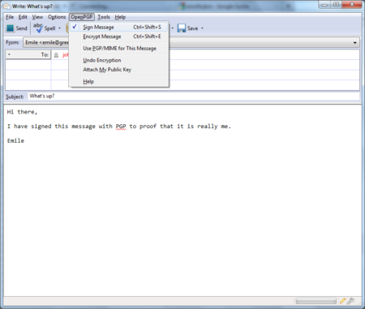

 4. Click on the  button and your signed mail will be sent. 

Sending encrypted mails to an individual
----------------------------------------

 1. You should have received the public key from the friend or colleague you want to email and you should have accepted their public key, using the method describe earlier in this chapter.

 2. In Thunderbird, click on the  icon.

 3. Compose a mail to the friend or colleague, from who you have previously received their public key. **Remember the subject line of the message will not be encrypted**, only the message body itself, and any attachments.

 4. Before actually sending the mail, enable the `OpenPGP > Encrypt Message` option via the menu bar of the mail compose window, if it is not enabled already. Once you have enabled this option, by clicking on it, a marked sign will appear. Clicking again should disable encryption again. See the example below.

 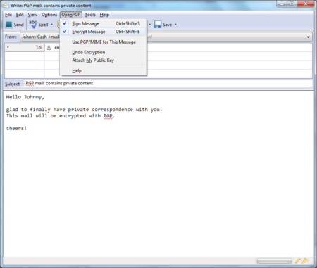

 5. Click on the  button and your encrypted mail will be sent.

Automating encryption to certain recipients
-------------------------------------------

You will often want to make sure all your messages to a certain colleague or friend are signed and encrypted. This is good practice, because you may forget to enable the encryption manually. You can do this by editing the per-recipient rules. To do this we access the OpenPGP per-recipient rule editor.

Select `OpenPGP > Preferences` from the Thunderbird menu bar.

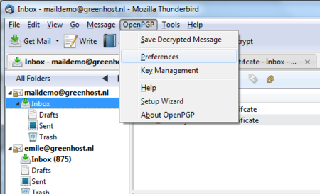

The preferences window will appear like below. We need to click on 'Display Expert Settings'.

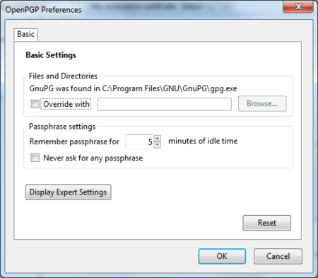

New menu tabs will appear in the window. Go to the tab 'Key Selection' and then click on the button labeled 'Edit Rules ...'

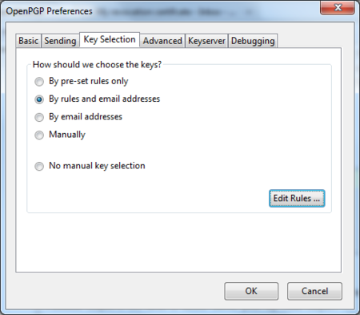

We are now shown the per-recipient rules editor (see below). This editor can be used to specify the way how messages to certain recipients are sent. We will now add a rule saying we want to encrypt and sign all mail messages to `maildemo@greenhost.nl`

First click on the 'Add' button.

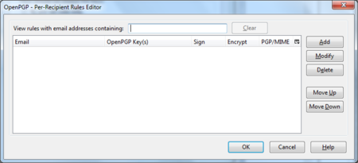

Now the window to add a new rule will be shown.

The first thing we should enter is the email address of the recipient. In the example below we have entered `maildemo@greenhost.nl`

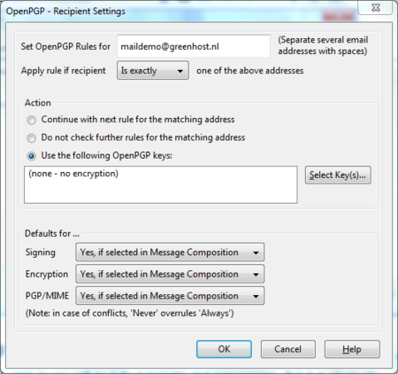

Now we will set the encryption defaults by using the drop-downs below. For Signing select 'Always'. For Encryption also select 'Always'.

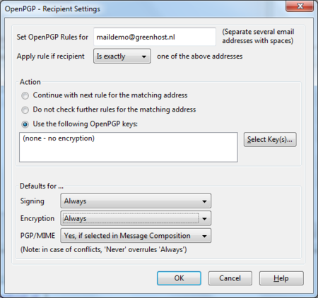

Finally we have to select the *public key* of the recipient, with which to encrypt our messages. Do not forget this important step, otherwise the e-mail will not be encrypted. Click on the button labeled 'Select Key(s)...'. The key selection window will show up. The most obvious key will be selected by default. In the example below, we only have one public key available. We can select keys by clicking on the small box next to the address. Then we click 'OK' and close all relevant windows and we are finished.

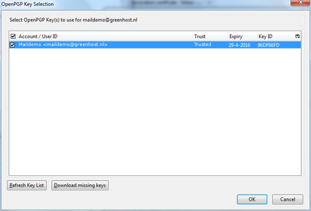

Verifying incoming e-mails
--------------------------

Decrypting email messages sent to you will be fully automatic and transparent. But it is obviously important to see whether or not a message to you has in fact been encrypted or signed. This information is available by looking at the special bar above the message body.

A valid signature will be recognized by a green bar above the mail message like the example image below.

The last example message was signed but not encrypted. If the message had been encrypted, it would show like this:

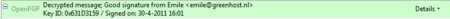

When a message which has been encrypted, but not signed, it could have been a forgery by someone. The status bar will become gray like in the image below and tells you that while the message was sent securely (encrypted), the sender could have been someone else than the person behind the email address you will see in the 'From' header. The signature is neccessaty to verify the real sender of the message. Of course it is perfectly possible that you have published your public key on the Internet and you allow people to send you emails anonymously. But is it also possible that someone is trying to impersonate one of your friends.

Similarly if you receive a signed email from somebody you know, and you have this persons public key, but still the status bar becomes yellow and displays a warning message, it is likely that someone is attempting to send you forged emails!

Sometimes secret keys get stolen or lost. The owner of the key will inform his friends and send them a so-called revocation certificate (more explanation of this in the next paragraph). Revocation means that we no longer trust the old key. The thief may afterwards still try his luck and send you a falsely signed mail message. The status bar will now look like this:

Strangely enough Thunderbird in this situation will still display a green status bar! It is important to look at the contents of the status bar in order to understand the encryption aspects of a message. GPG allows for strong security and privacy, but only if you are familiar with its use and concepts. Pay attention to warnings in the status bar.

Revoking your GPG key-pair
--------------------------

Your secret key has been stolen by somebody. Your harddisk crashed and you have lost all your data. If your key is lost, you can no longer decrypt messages. If your key has been stolen, somebody else can decrypt your communication. You need to make a new set of keys. The process of creating keys, using the OpenPGP wizard in Thunderbird, has been described in this manual. But first you want to tell the world that your old public key is now worthless, or even dangerous to use.

What to do when you have lost your secret key, or forgot your passphrase
------------------------------------------------------------------------

During the creation of your key-pair, the OpenPGP wizard offered you the possibility to create a so-called revocation certificate. This is a special file you send to others in the advent you have to disable your key. If you have a copy of this file, sending the revocation key is simply sending the file as an attachment to all your friends. You can no longer send signed mails (obviously, because you have lost your secret key). That doesn't matter. Send it as a normal mail. The revocation certificate file could only have been created by the owner of the secret key and proofs he or she wants to revoke it. That's why it should normally be kept hidden from others.

If you do not have the revocation certificate, there exists no other option than for you to contact your friends personally and convince them your key is lost and that they should no longer trust it.

What to do when your secret key has been stolen, or compromised
---------------------------------------------------------------

If you have reason to believe your secret key has been compromised, or worse your secret key and passphrase, it is very important to contact others that they should stop sending you encrypted messages. With your secret key, other persons will be able to break the encryption of your e-mail messages if they also have your passphrase. This is also true for those messages you have send in the past. Cracking the passphrase is not trivial, but it may be possible if the party has lots of resources, like a state or a big organization for example, or if your passphrase is too weak. In any case you should assume the worst and assume your passphrase may have been compromised. Send a revocation certificate file to all your friends or contact them personally and inform them of the situation.

Even after you have revoked your old key pair, the stolen key may still be used to decrypt your previous correspondence. You should consider other ways to protect that old correspondence, for instance by re-encrypting it with a new key. The latter operation will not be discussed in this manual. If you are uncertain you should seek assistance from experts or look up more information on the web.

Receiving a revocation certificate
----------------------------------

If one of your friends sends you a revocation certificate, s/he asks you to distrust his public key from now on. You should always accept such a request and 'import' the certificate to disable their key. The process of accepting a revocation certificate is exactly the same as accepting a public key, as has already been described in the chapter. Thunderbird will ask you if you want to import the 'OpenPGP key file'. Once you have done so, a confirmation pop-up should be displayed like below.

Preparing for the worst: backup your keys
-----------------------------------------

Your keys are usually stored on your hard disk as normal files. They may get lost if your computer gets damaged. It is strongly advised to keep a backup of your keys in a safe place, like a vault. Making a a backup of your secret key has another security advantage as well. Whenever you fear your laptop or computer is in immediate danger of being confiscated, you can safely delete your key-pair. Your email will be rendered unreadable immediately. At a later stage, you can retrieve your keys from the vault and re-import them in Thunderbird.

To make a backup of your key-pair, first head to the key manager by using the Thunderbird menu and click on `OpenPGP > Key Management`.

You need to have selected the 'Display All Keys by Default' option to get a list of all your keys. Lookup your own email address in the list and right click on the address. A selection window will appear with some options. Select the option 'Export Keys to File'.

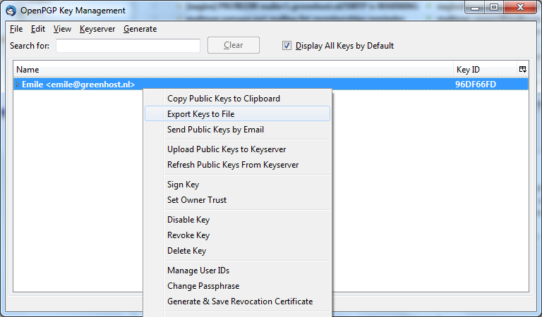

Now we will save the key-pair to a file. Thunderbird asks us if we want to include the secret key as well. We do want to include the secret key, therefore we select 'Export Secret Keys'.

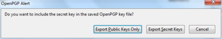

Finally Thunderbird asks us for the location of the key file. You can store the file anywhere you like, network disk, USB-stick. Just remember to hide it away from other people.

Further reading
---------------

More documentation on using GPG with Thunderbird can be found on the website of the Enigmail plugin. The Enigmail handbook is the guide you will want to use.

[http://enigmail.mozdev.org/documentation/handbook.php.html](http://enigmail.mozdev.org/documentation/handbook.php.html)
