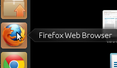
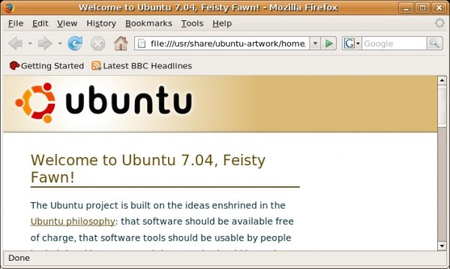

Accessing Firefox on Ubuntu
===========================

Firefox is already installed on Ubuntu by default. To open it, click on the Unity side bar where you see the Firefox icon:

Firefox starts and a welcome window opens:

