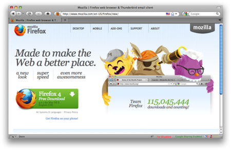
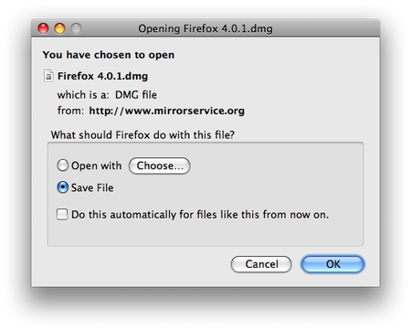
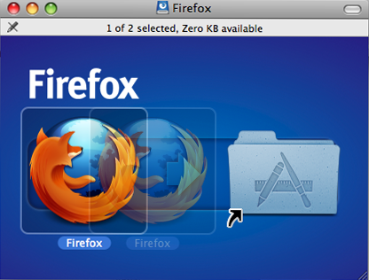
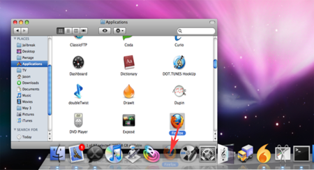
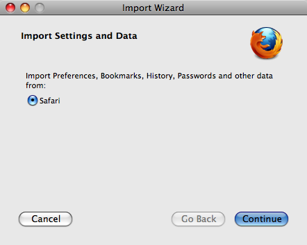
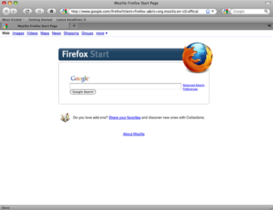

Installing on Mac OS X
======================

 1. To download Firefox, visit [https://www.mozilla.org/firefox](https://www.mozilla.org/firefox) and click on the big green button labeled "Firefox Free Download". The download should start automatically, if it does not, click the link to download it manually.

  

 2. When prompted, click **OK**.

  

 Once the download is complete a window similar to this appears:

 

 3. Click and drag the **Firefox** icon on top of the **Applications** icon.

 4. When the installation is finished, close the two small Firefox windows.
 5. Eject the Firefox disk image. If this does not work by normal means, select the disk image icon and then, in the Finder menu, select `File > Eject Firefox`.
 6. Now, open the **Applications** directory and drag the **Firefox** icon to the dock:

 

 7. Click the **Firefox** icon in the Dock to start Firefox. The Import Wizard dialog box appears:

 

 8. To import your bookmarks, passwords and other data from Safari, click **Continue**. If you don't want to import anything, just select **Cancel**.

Congratulations, you are now ready to use Firefox!

