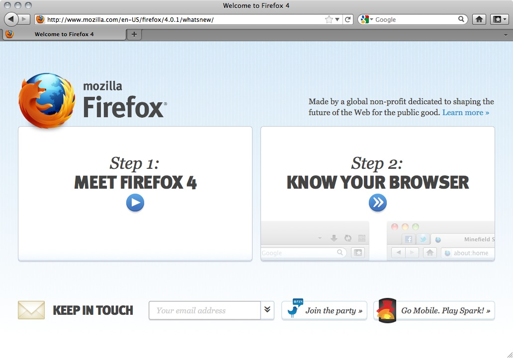
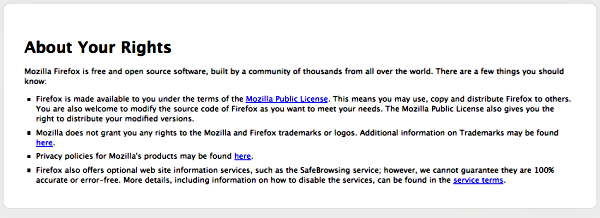

Installing on Mac OS X
======================

 1. To download **Firefox**, visit [http://www.mozilla.com/](http://www.mozilla.com/) and click on the big green button labeled "Firefox Free Download.", and the download starts. If it does not start automatically, click the link on the page.

  

 2. When prompted, click **OK**.

  

 Once the download is complete a window similar to this appears:

 

 3. Click and hold the **Firefox** icon, then drag it on top of the **Applications** icon. When it is on top of the Applications icon, release the mouse button. This starts copying the program files to the Applications directory on your computer.

 4. When the installation step is finished, close the two small Firefox windows.
 5. Eject the Firefox disk image. If this does not work by normal means, select the disk image icon and then, in the Finder menu, select `File > Eject Firefox`.
 6. Now, open the **Applications** directory and drag the **Firefox** icon to the dock:

 

 7. Click either icon (in the Dock or the Applications folder) to start Firefox. The Import Wizard dialog box appears:

 

 8. To import your bookmarks, passwords and other data from Safari, click **Continue**. If you don't want to import anything, just select **Cancel**.

 9. Click **Continue**. Now you see the **Welcome to Firefox** page.

 

    * To learn basic information about Firefox, click **Getting Started**.
    * For assistance, click **Visit Support**.
    * To customize your new installation using the add-ons wizard, click **Customize Now!**
    * In the upper right of the Welcome page is a button labeled **Know your rights**. Click this button to display the following screen, which tells you about your rights under the Mozilla Public License and provides links to Mozilla's privacy policies and service terms, as well as trademark information.

 

 10. Close the Welcome to Firefox page (click the x in the tab at the top of the page). Now you see the **Firefox Start** page.

Congratulations, you are now ready to use Firefox!

If you have permission problems when trying to copy Firefox from the disk image to your Applications folder, first try deleting your old Firefox copy, then proceeding.

If you're installing a beta and that you want to keep your former Firefox copy, first rename your old Firefox copy to something like "Firefox old" and then copy the beta to your Applications folder.
