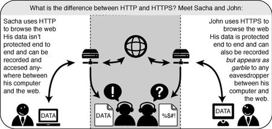
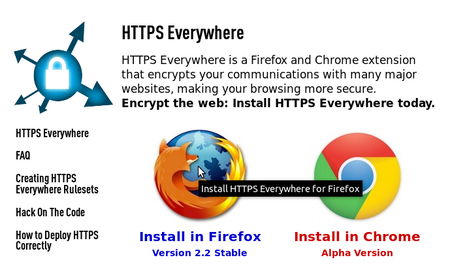
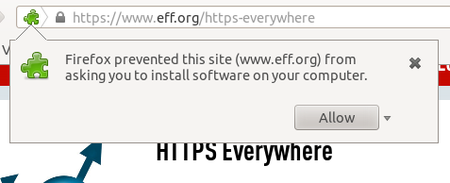
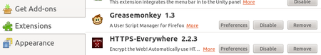
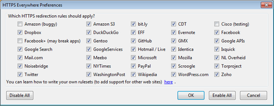
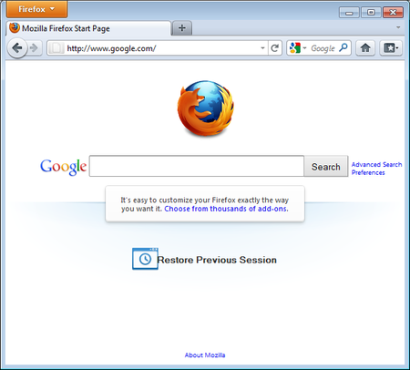
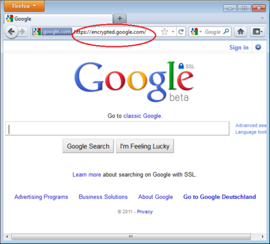
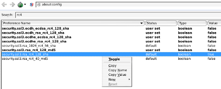
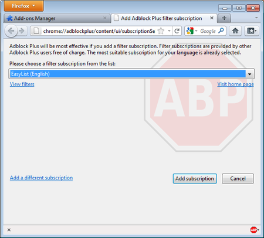

Extending Firefox
=================

When you first download and install Firefox, it can handle basic browser tasks immediately. You can also add extra capabilities or change the way Firefox behaves by installing add-ons, small additions that extend Firefox's power.

Firefox extensions can pimp your browser, but they can also collect and transmit information about you. Before you install any add-on, keep in mind to choose add-ons from trusted sources. Otherwise, an add-on might share information about you without your knowing, keep a record on the sites you have visited, or even harm your computer.

There are several kinds of add-ons:

 * *Extensions* add functionality to Firefox
 * *Themes* change the appearance of Firefox.
 * *Plugins* help Firefox handle things it normally can't process (i.e. Flash movies, Java applications).

For the topics covered in this book we are only going to need extensions. We will look at some add-ons that are particularly relevant for dealing with Internet security. The variety of available extensions is enormous. You can add dictionaries for different languages, track the weather in other countries, get suggestions for Web sites that are similar to the one you are currently viewing, and much more. Firefox keeps a list of current extensions on its site ([https://addons.mozilla.org/firefox](https://addons.mozilla.org/firefox)), or you can browse them by category at [https://addons.mozilla.org/firefox/browse](https://addons.mozilla.org/firefox/browse).

**Caution:** We recommend that you never install an add-on for Firefox unless it is available from the Firefox add-on pages. You should also never install Firefox unless you get the installation files from a trusted source. It is important to note that using Firefox on someone else's computer or in an Internet caf increases your potential vulnerability. Know that you can take Firefox on a CD or USB-stick (check our chapter on that issue).

While no tool can protect you completely against all threats to your online privacy and security, the Firefox extensions described in this chapter can significantly reduce your exposure to the most common ones, and increase your chances of remaining anonymous.

HTTPS Everywhere
----------------

HTTP is considered unsafe, because communication is transmitted in plain text. Many sites on the Web offer some support for encryption over HTTPS, but make it difficult to use. For instance, they may connect you to HTTP by default, even when HTTPS is available, or they may fill encrypted pages with links that go back to the unencrypted site. The HTTPS Everywhere extension fixes these problems by rewriting all requests to these sites to HTTPS. Although the extension is called "HTTPS Everywhere", it only activates HTTPS on a particular list of sites and can only use HTTPS on sites that have chosen to support it. It cannot make your connection to a site secure if that site does not offer HTTPS as an option.

Please note that some of those sites still include a lot of content, such as images or icons, from third party domains that is not available over HTTPS. As always, if the browser's lock icon is broken or carries an exclamation mark, you may remain vulnerable to some adversaries that use active attacks or traffic analysis. However, the effort required to monitor your browsing should still be usefully increased.

Some Web sites (such as Gmail) provide HTTPS support automatically, but using HTTPS Everywhere will also protect you from TLS/SSL-stripping attacks, in which an attacker hides the HTTPS version of the site from your computer if you initially try to access the HTTP version.

Additional information can be found at: [https://www.eff.org/https-everywhere](https://www.eff.org/https-everywhere).

Installation
------------

First, download the HTTPS Everywhere extension from the official Web site: [https://www.eff.org/https-everywhere](https://www.eff.org/https-everywhere)

Select the newest release. In the example below, version 2.2 of HTTPS Everywhere was used. (A newer version may be available now.)

Click on "Allow". You will then have to restart Firefox by clicking on the "Restart Now" button. HTTPS Everywhere is now installed.

Configuration
-------------

To access the HTTPS Everywhere settings panel in Firefox 4 (Linux), click on the Tools menu at the top of your screen and then select Add-ons. (Note that in different versions of Firefox and different operating systems, the Add-ons Manager may be located in different places in the interface.)

Click on the Preferences button.

A list of all supported Web sites where HTTPS redirection rules should be applied will be displayed. If you have problems with a specific redirection rule, you can uncheck it here. In that case, HTTPS Everywhere will no longer modify your connections to that specific site.

Usage
-----

Once enabled and configured, HTTPS Everywhere is very easy and transparent to use. Type an insecure HTTP URL (for example, [http://www.google.com](http://www.google.com)).

Press Enter. You will be automatically redirected to the secure HTTPS encrypted Web site (in this example: [https://encrypted.google.com](https://encrypted.google.com)). No other action is needed.

If networks block HTTPS
-----------------------

Your network operator may decide to block the secure versions of Web sites in order to increase its ability to spy on what you do. In such cases, HTTPS Everywhere could prevent you from using these sites because it forces your browser to use only the secure version of these sites, never the insecure version. (For example, we heard about an airport WiFi network where all HTTP connections were permitted, but not HTTPS connections. Perhaps the WiFi operators were interested in watching what users did. At that airport, users with HTTPS Everywhere were not able to use certain Web sites unless they temporarily disabled HTTPS Everywhere.)

In this scenario, you might choose to use HTTPS Everywhere together with a circumvention technology such as Tor or a VPN in order to bypass the network's blocking of secure access to Web sites.

Adding support for additional sites in HTTPS Everywhere
-------------------------------------------------------

You can add your own rules to the HTTPS Everywhere add-on for your favorite Web sites. You can find out how to do that at: [https://www.eff.org/https-everywhere/rulesets](https://www.eff.org/https-everywhere/rulesets). The benefit of adding rules is that they teach HTTPS Everywhere how to ensure that your access to these sites is secure. But remember: HTTPS Everywhere does not allow you to access sites securely unless the site operators have already chosen to make their sites available through HTTPS. If a site does not support HTTPS, there is no benefit to adding a ruleset for it.

If you are managing a Web site and have made an HTTPS version of the site available, a good practice would be to submit your Web site to the official HTTPS Everywhere release.

Enforcing secure HTTPS server connections
-----------------------------------------

Even if you instruct your browser to use the HTTPS protocol when communicating with a web server, it is still possible that the server (due to unsecure configuration on its own side) enforces a unsecure SSL cipher protocol for the connection. The only way to prevent this is by telling the browser to not accept such unsecure SSL protocols (like those based on RC4 encryption).

To disable RC4 encryption for HTTPS connections you have to switch those off in Firefox. In an empty address bar type "about:config", press return and close the warning dialog displayed next (you can disable this dialog if you want for the next time you configure Firefox). In the search field enter "rc4" and look at the list displayed as a search result:

Any entry with a "true" in the last column ("Value" field) is activated and should be de-activated. Simply right-click on the entry and "Toggle" the value field to false. Proceed for all entries until all of them have a value of "false".

Adblock Plus
------------

Adblock Plus ([http://www.adblockplus.org](http://www.adblockplus.org)) is mainly known for blocking advertisements on websites. But it also can be used to block other content that may try to track you. To keep current with the latest threats, Adblock Plus relies on blacklists maintained by volunteers.

Extra Geek info: How does Adblock Plus block addresses?

The hard work here is actually done by Gecko, the engine on top of which Firefox, Thunderbird and other applications are built. It allows something called "content policies". A content policy is simply a JavaScript (or C++) object that gets called whenever the browser needs to load something. It can then look at the address that should be loaded and some other data and decide whether it should be allowed. There is a number of built-in content policies (when you define which sites shouldn't be allowed to load images in Firefox or SeaMonkey, you are actually configuring one of these built-in content policies) and any extension can register one. So all that Adblock Plus has to do is to register its content policy, other than that there is only application logic to decide which addresses to block and user interface code to allow configuration of filters.

Getting started with Adblock Plus
---------------------------------

Once you have Firefox installed:

 1. Download the latest version of Adblock Plus from the Add-On database of Firefox
 2. Confirm that your want Adblock Plus by clicking "Install Now".
 3. After Adblock Plus has been installed, Firefox will ask to restart.

Choosing a filter subscription
------------------------------

Adblock Plus by itself doesn't do anything. It can see each element that a Web site attempts to load, but it doesn't know which ones should be blocked. This is what Adblock's filters are for. After restarting Firefox, you will be asked to choose a filter subscription (free).

Which filter subscription should you choose? Adblock Plus offers a few in its dropdown menu and you may wish to learn about the strengths of each. A good filter to start protecting your privacy is EasyList (also available at [http://easylist.adblockplus.org/en](http://easylist.adblockplus.org/en)).

As tempting as it may seem, don't add as many subscriptions as you can get, since some may overlap, resulting in unexpected outcomes. EasyList (mainly targeted at English-language sites) works well with other EasyList extensions (such as region-specific lists like RuAdList or thematic lists like EasyPrivacy). But it collides with Fanboy's List (another list with main focus on English-language sites).

You can always change your filter subscriptions at any time within preferences. Once you've made your changes, click OK.

Creating personalized filters
-----------------------------

AdBlock Plus also lets you create your own filters, if you are so inclined. To add a filter, start with Adblock Plus preferences and click on "Add Filter" at the bottom left corner of the window. Personalized filters may not replace the benefits of well-maintained blacklists like EasyList, but they're very useful for blocking specific content that isn't covered in the public lists. For example, if you wanted to prevent interaction with Facebook from other Web sites, you could add the following filter:

    ||facebook.*$domain=~facebook.com|~127.0.0.1

The first part (`||facebook.*`) will initially block everything coming from Facebook's domain. The second part (`$domain=~facebook.com|~127.0.0.1`) is an exception that tells the filter to allow Facebook requests only when you are in Facebook or if the Facebook requests come from 127.0.0.1 (your own computer) in order to keep certain features of Facebook working.

A guide on how to create your own Adblock Plus filters can be found at [http://adblockplus.org/en/filters](http://adblockplus.org/en/filters).

Enabling and disabling AdBlock Plus for specific elements or Web sites
----------------------------------------------------------------------

You can see the elements identified by AdBlock Plus by clicking on the ABP icon AdBlock Plus icon in your browser (usually next to the search bar) and selecting "Open blockable items". A window at the bottom of your browser will let you enable or disable each element on a case-by-case basis. Alternatively, you can disable AdBlock Plus for a specific domain or page by clicking on the ABP icon and ticking the option "Disable on [domain name]" or "Disable on this page only".

Other extensions that can improve your security
-----------------------------------------------

Below is a short list of extensions that are not covered in this book but are helpful to further protect you.

 * **Flagfox** - puts a flag in the location bar telling you where the server you are visiting is most probably located. [https://addons.mozilla.org/en-US/firefox/addon/flagfox/](https://addons.mozilla.org/en-US/firefox/addon/flagfox/)

 * **BetterPrivacy** - manages "cookies" used to track you while visiting websites. Cookies are small bits of information stored in your browser. Some of them are used to track the sites you are visiting by advertisers. [https://addons.mozilla.org/en-US/firefox/addon/betterprivacy/](https://addons.mozilla.org/en-US/firefox/addon/betterprivacy/)

 * **GoogleSharing** - If you are worried that google knows your search history, this extension will help prevent that. [https://addons.mozilla.org/en-us/firefox/addon/googlesharing/](https://addons.mozilla.org/en-us/firefox/addon/googlesharing/)

 * **NoScript** - Although not friendly for beginners, this addon will block scripts and third party plugin content (eg, Adobe Flash) unless specifically allowed by the user, it also provides general protection against simple cross site scripting vectors. [http://noscript.net/](http://noscript.net/)

 * **User Agent Switcher** - Your browser supplies large amounts of identifying information to any remote server through the 'User-Agent' header, including Operating System and specific version information. This addon allows you to supply either a fake or generic User-Agent to the server. [http://chrispederick.com/work/user-agent-switcher/](http://chrispederick.com/work/user-agent-switcher/)
