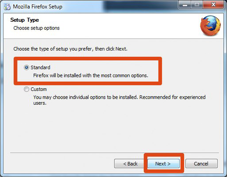
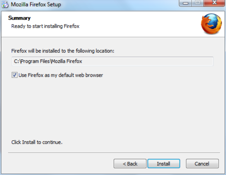
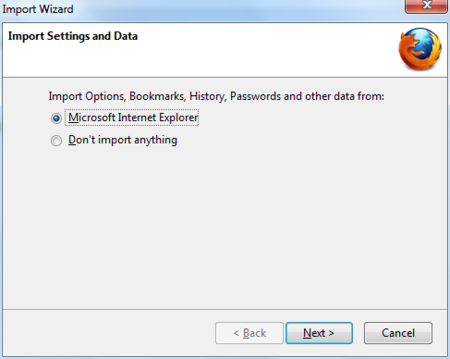

Installing Firefox on Windows
=============================

 1. To download Firefox, visit [https://www.mozilla.com/firefox/](https://www.mozilla.com/firefox/).

 

 2. Click the download button and the installation file will begin to download to your computer.

 3. Once the download is complete, double-click the installation file to start the Firefox installation wizard.

    * If you are running Windows Vista, you may get a User Account Control prompt. In this case, allow the setup to run by clicking **Continue**.
    * If you are running Windows 7, you will be asked whether to allow Firefox to make changes to your computer. Click on **Yes**.

    A welcome screen appears.

 4. Click **Next** to continue. You will be asked if you would like the standard installation, or whether you would like to customize it. Choose the standard installation and click **Next**.

 

 5. You will be asked if you want Firefox to be your default browser. This is recommended.

 

 6. Click **Install**.

 7. To import your bookmarks and other data from other browsers (for example Internet Explorer), click **Continue**. If you don't want to import anything, just select **Cancel**.

 

 8. Once Firefox has been installed, click **Finish** to close the setup wizard.

If the **Launch Firefox now** check box is checked, Firefox will start after you click **Finish**. Otherwise you can launch Firefox through the start menu.

### Windows Vista Users

If at any time throughout the installation process you are prompted with a User Account Control (UAC) window, press Continue, Allow, or Accept.

Troubleshooting
---------------

If you have problems starting Firefox, see [https://support.mozilla.com/kb/Firefox+will+not+start](https://support.mozilla.com/kb/Firefox+will+not+start)