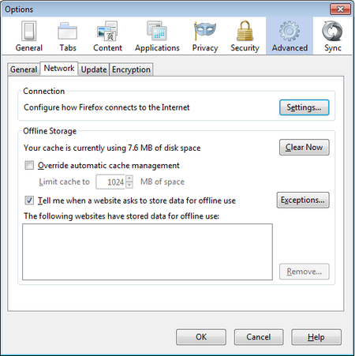
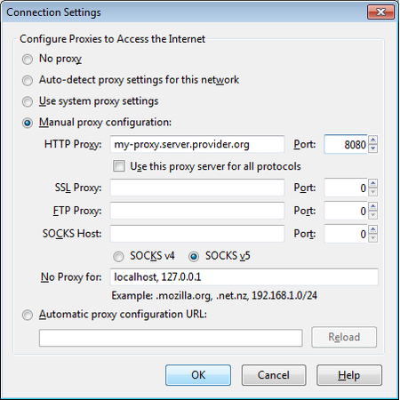

Proxy Settings
==============

A proxy server allows you to reach a Web site or other Internet location even when direct access is blocked in your country or by your ISP. There are many different kinds of proxies, including:

 * Web proxies, which only require that you know the address to the proxy Web site, which may have a URL similar to `http://proxy.com/cgi-bin/nph-proxy.cgi`
 * HTTP proxies, which require that you modify your Browser settings. HTTP proxies only work for Web content. You may get the information about a HTTP proxy in the format `proxy.example.com:3128` or `192.168.0.1:8080`.
 * SOCKS proxies, which also require that you modify your Browser settings. SOCKS proxies work for many different Internet applications, including e-mail and instant messaging tools. The SOCKS proxy information looks just like HTTP proxy information.

You can use a Web proxy directly without any configuration by typing in the URL. The HTTP and SOCKS proxies, however, have to be configured in your Web browser.

Default Firefox proxy configuration
-----------------------------------

In Firefox you can change the settings for using a proxy.  You'll need to open the Options or Preferences window of Firefox. You can find this in the menu, by clicking on the top of the Window and selecting `Edit > Preferences` on Linux or `Tools > Options` on Windows.

Go to the Network section and open the Advanced tab.

Select Settings, click on "Manual proxy configuration" and enter the information of the proxy server you want to use. Please remember that HTTP proxies and SOCKS proxies work differently and have to be entered in the corresponding fields. If there is a colon (:) in your proxy information, that is the separator between the proxy address and the port number. Your screen should look like this:

After you click OK, your configuration will be saved and your Web browser will automatically connect through that proxy on all future connections. If you get an error message such as, "The proxy server is refusing connections" or "Unable to find the proxy server", there is a problem with your proxy configuration. In that case, repeat the steps above and select "No proxy" in the last screen to deactivate the proxy.
