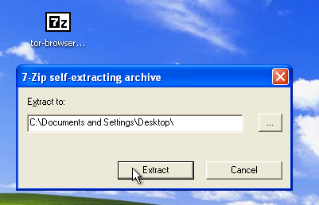
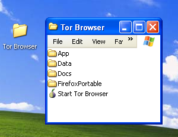
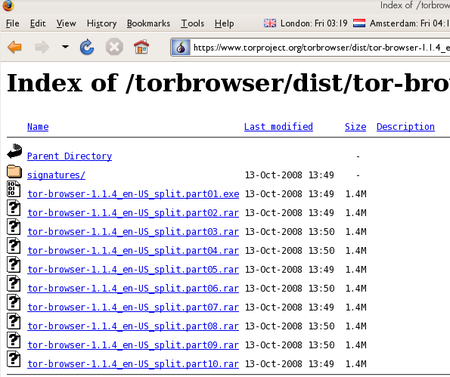
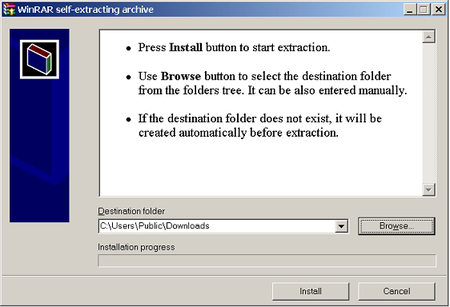
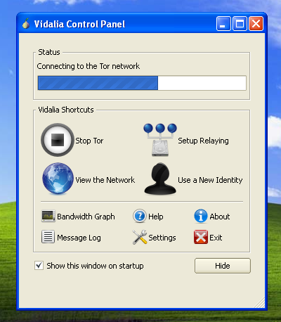
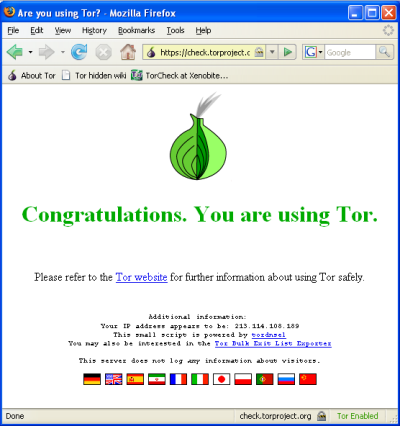
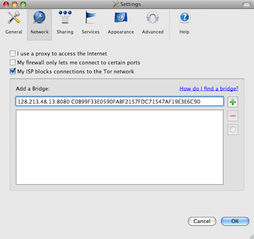

Using Tor?
==========

Tor is a system intended to enable online anonymity, composed of client software and a network of servers which can hide information about users' locations and other factors which might identify them. Imagine a message being wrapped in several layers of protection: every server needs to take off one layer, thereby immediately deleting the sender information of the previous server.

Use of this system makes it more difficult to trace internet traffic to the user, including visits to Web sites, online posts, instant messages, and other communication forms. It is intended to protect users' personal freedom, privacy, and ability to conduct confidential business, by keeping their internet activities from being monitored. The software is open-source and the network is free of charge to use.

Like all current low latency anonymity networks, Tor cannot and does not attempt to protect against monitoring of traffic at the boundaries of the Tor network, i.e., the traffic entering and exiting the network. While Tor does provide protection against traffic analysis, it cannot prevent traffic confirmation (also called end-to-end correlation)

Caution: As Tor does not, and by design cannot, encrypt the traffic between an exit node and the target server, any exit node is in a position to capture any traffic passing through it which does not use end-to-end encryption such as TLS. (If your postman is corrupt he might still open the envelope and read the content). While this may or may not inherently violate the anonymity of the source, if users mistake Tor's anonymity for end-to-end encryption they may be subject to additional risk of data interception by third parties. So: the location of the user remains hidden; however, in some cases content is vulnerable for analysis through which also information about the user may be gained.

Using Tor Browser Bundle
------------------------

The Tor Browser Bundle lets you use Tor on Windows, OSX and/or Linux without requiring you to configure a Web browser. Even better, it's also a portable application that can be run from a USB flash drive, allowing you to carry it to any PC without installing it on each computer's hard drive.

Downloading Tor Browser Bundle
------------------------------

You can download the Tor Browser Bundle from the torproject.org Web site ([https://www.torproject.org](https://www.torproject.org)), either as a single file (13MB) or a split version that is multiple files of 1.4 MB each which may proof easier to download on slow connections.

If the torproject.org Web site is filtered from where you are, type "tor mirrors" in your favorite Web search engine: The results probably include some alternative addresses to download the Tor Browser Bundle.

Caution: When you download Tor Bundle (plain or split versions), you should check the signatures of the files, especially if you are downloading the files from a mirror site. This step ensures that the files have not been tampered with. To learn more about signature files and how to check them, read [https://www.torproject.org/docs/verifying-signatures](https://www.torproject.org/docs/verifying-signatures)

(You can also download the GnuPG software that you will need to check the signature here: [http://www.gnupg.org/download/index.en.html#auto-ref-2](http://www.gnupg.org/download/index.en.html#auto-ref-2))

The instructions below refer to installing Tor Browser on Microsoft Windows. If you are using a different operating system, refer to the torproject.org website for download links and instructions.

### Installing from a single file

 1. In your Web browser, enter the download URL for Tor Browser:
    [https://www.torproject.org/download/download](https://www.torproject.org/download/download)

 

 2. Click the link for your language to download the installation file.

 3. On windows double-click the .EXE file you just downloaded. A "7-Zip self-extracting archive" window appears.

 

 4. Choose a folder into which you want to extract the files and click "Extract".

 **Note:** You can choose to extract the files directly onto a USB key or memory stick if you want to use Tor Browser on different computers (for instance on public computers in Internet cafes).

 5. When the extraction is completed, open the folder and check that the contents match the image below:

 

 6. To clean up, delete the .EXE file you originally downloaded.

### Installing from split files

 1. In your Web browser, enter the URL for the split version of the Tor Browser Bundle (https://www.torproject.org/torbrowser/split.html), then click the link for your language to get to a page that looks like the one for English below:

 

 2. Click each file to download it (one ending in ".exe" and nine others ending in ".rar"), one after the other, and save them all in one folder on your hard- or USB-drive.

 3. Double-click the first part (the file whose name ends in ".exe"). This runs a program to gather all the parts together.

 

 4. Choose a folder where you want to install the files, and click "Install". The program displays messages about its progress while it's running, and then quits.

 5. When the extraction is completed, open the folder and check that the contents match the image below:

 

 6. To clean up, delete all the files you originally downloaded.

Using Tor Browser
-----------------

Before you start:

 * **Close Firefox.** If Firefox is installed on your computer, make sure it is not currently running.

 * **Close Tor.** If Tor is already installed on your computer, make sure it is not currently running.

Launch Tor Browser:

 1. In the "Tor Browser" folder, double-click "Start Tor Browser". The Tor control panel ("Vidalia") opens and Tor starts to connect to the Tor network.

 

 2. When a connection is established, Firefox automatically connects to the TorCheck page and then confirms if you are connected to the Tor network. This may take some time, depending on the quality of your Internet connection.

 

 3. If you are connected to the Tor network, a green onion icon appears in the System Tray on the lower-right-hand corner of your screen:

 

Browsing the Web using Tor Browser
----------------------------------

Try viewing a few Web sites, and see whether they display. The sites are likely to load more slowly than usual because your connection is being routed through several relays.

If this does not work
---------------------

If the onion in the Vidalia Control Panel never turns green or if Firefox opened, but displayed a page saying "Sorry. You are not using Tor", as in the image below, then you are not using Tor.

If you see this message, close Firefox and Tor Browser and then repeat the steps above. You can perform this check to ensure that you are using tor, at any time by clicking the bookmark button labelled "TorCheck at Xenobite..." in the Firefox toolbar.

If Firefox browser does not launch, another instance of the browser may be interfering with Tor Browser. To fix this:

 1. Open the Windows Task Manager. How you do this depends on how your computer is set up. On most systems, you can right-click in the Task Bar and then click "Task Manager".
 2. Click the "Processes" tab.
 3. Look for a process in the list named "firefox.exe".
 4. If you find one, select the entry and click "End Process".
 5. Repeat the steps above to launch Tor Browser.

If Tor Browser still doesn't work after two or three tries, Tor may be partly blocked by your ISP and you should try using the **bridge** feature of Tor.

Using Tor Bridges
-----------------

If you still can not connect, your ISP may be filtering your connection and preventing access to the Tor network.  In this case, connecting through a Tor bridge may help.  A Tor bridge is a relay that's not listed.  The first step in using a bridge is finding one.

The easiest way to find a bridge is to visit the Tor bridge website ([https://bridges.torproject.org/](https://bridges.torproject.org/)), however if that site is blocked, you can also send an email (it must be from a Gmail account) to bridges@bridges.torproject.org with the line "get bridges" by itself in the body of the mail.

Once you have a bridge, or lists of bridges, you can enter them into Vidalia's network configuration.  Once you click, "My ISP blocks connections to the Tor network," you will be able to enter the bridge address.

