Encrypting Passwords with a Password Manager
============================================

To encrypt password we use KeePass on Windows and KeePassX Ubuntu, and Keychain on OSX. The basic principle is the same; you have a file on your computer which is encrypted with *one single very secure password*. This is sometimes referred to as a 'Master Password', 'Admin-Password', 'Root-Password' etc. but they are all *the ultimate key* to all your other keys and secure data. For this reason you can't and shouldn't think to light about creating this password.

If a password manager is part of your OS (like it is with OSX) it unlocks automatically for you after you login to your account and so opening secure information like passwords. For this, and other, reasons you should disable 'Automatically Login'. When you start-up your computer you should always have to login and, even better, set your computer to automatically logout or lock the screen after a set amount of time.

Encrypting Passwords with KeePassX on Ubuntu
--------------------------------------------

First open KeePassX from the Applications->Accessories -> KeePassX menu.

The first time you use KeePassX you need to set up a new database to store your passwords. Click on File->New Database

You will be asked to set a master key (password).

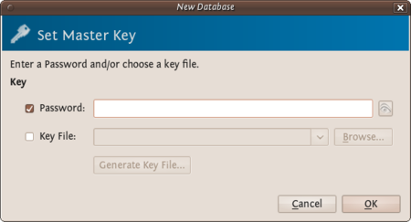

Choose a strong password for this field - refer to the chapter about passwords if you would like some tips on how to do this. Enter the password and press 'OK'. You then are asked to enter the password again. Do so and press 'OK'. If the passwords are the same you will see a new KeePassX 'database' ready for you to use.

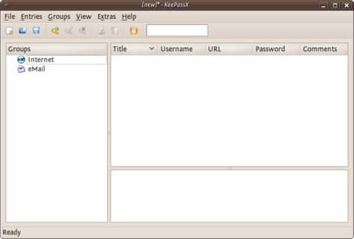

Now you have a place to store all your passwords and protect them by the 'master' password you just set. You will see two default categories 'Internet' and 'Email' - you can store passwords just under these two categories, you can delete categories, add sub-groups, or create new categories. For now we just want to stay with these two and add a password for our email to the email group. Right click on the email category and choose 'Add New Entry...':

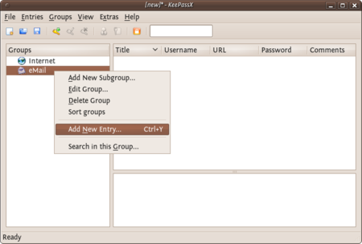

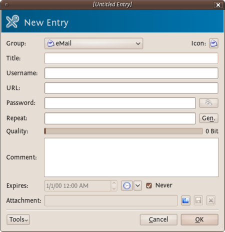

So now fill this form out with the details so you can correctly identify which email account the passwords are associated with. You need to fill out the fields 'Title' and the password fields. All else is optional.

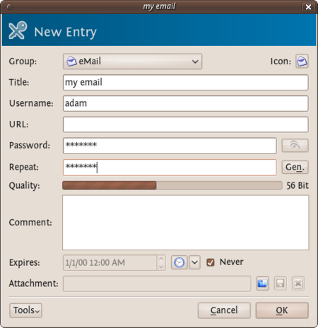

KeePassX gives some indication if the passwords you are using are 'strong' or 'weak'. As may be obvious, you should try to use stronger passwords. For advice on this see the chapter on creating good passwords. Press 'OK' when you are done and you will see something like this:

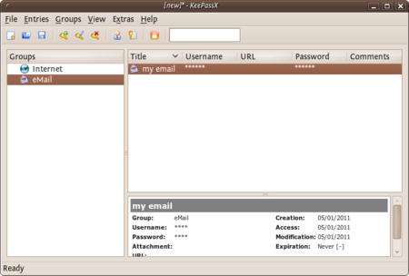

To recover the passwords (see them) you must double click on the enter and you will see the same window you used for recording the information. If you click on the 'eye' icon to the right of the passwords they will be converted from stars (***) to the plain text so you can read it.

Now you you can use KeePassX to store your passwords. However before getting too excited you must do one last thing. When you close KeePassX (choose File->Quit) it asks you if you would like to save the changes you have made.

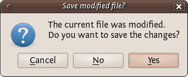

Press 'Yes'. If it is the first time you used KeePassX (or you have just created a new database) you must choose a place to store your passwords. Otherwise it will save the updated information in the file you have previously created.

When you want to access the passwords you must then open KeePassX and you will be asked for the master key. After typing this in you can add all your passwords to the database and see all your entries. It is not a good idea to open KeePassX and have it open permanently as then anyone could see your passwords if they can access your computer. Instead get into the practice of just opening it when you need it and then closing it again.

Encrypting Passwords with KeePass on Windows
--------------------------------------------

After you installed KeePass on Windows you can find it in the application menu. Launch the application and the following window should appear.

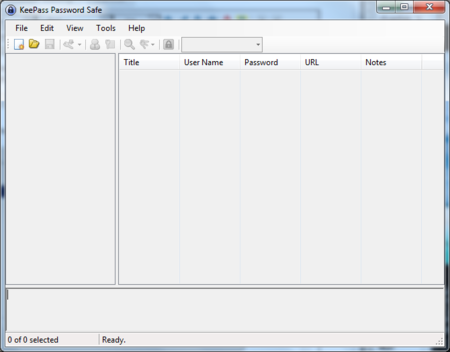

You start by making a database, the file which will contain your key. From the menu select `File > New`. You have to chose the name and the location of the file in the dialog window below. In this example we call our database `my_password_database`.

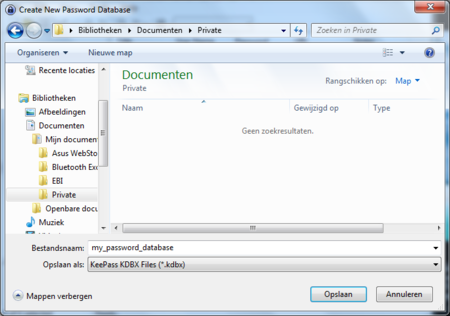

The next screen will ask you for the master password. Enter the password and click on 'OK'. You will not need to select anything else.

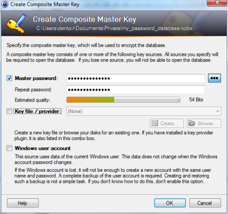

The next window allows you to configure your new database. We do not need to edit anything. Just click on 'OK'.

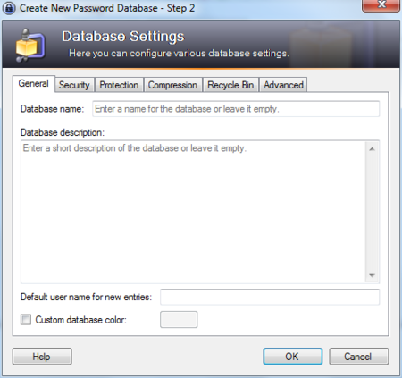

Now the main window appears again and we see some default password categories on the left side. Lets add a new password in the category 'Internet'. First click on the word 'Internet', then click on the add entry icon under the menu bar.

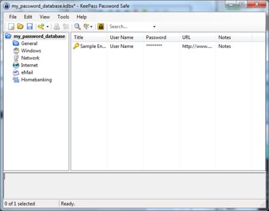

A window will appear like below. Use the fields to give a description of this particular password, and of course, enter the password itself. When done, click on 'OK'.

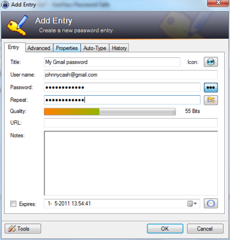

Encrypting Passwords with Keychain on Mac OSX
---------------------------------------------

Mac OSX comes pre-installed with the build in password manager 'Keychain'. Because of it's tight integration with the OS most of the time you will hardly know it exists. But every now and then you will have a pop-up window in almost any application asking 'do you want to store this password in your keychain?'. This happens when you add new email accounts to your mail client, login to a protected wireless network, enter your details in your chat client etc. etc. etc.

Basically what happens is that Mac OSX offers you to store all that login data and different passwords in an encrypted file which it unlocks as soon as you login to your account. You can then check your mail, logon to your WiFi and use your chat client without having to enter your login data all the time over and over again. This is a fully automated process, but if you want to see what is stored where and alter passwords, or lookup a password you will have to open the Keychain program.

You can find the Keychain program in the Utilities folder which lives in the Applications folder.

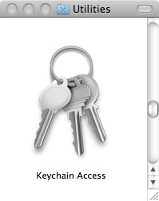

When you open it you will see that your 'Login' keychain is unlocked and see all the items contained in it on the right bottom side of the window.

(note: the window here is empty because it seemed to be deceiving the purpose of this manual to make a screenshot of my personal keychain items and share it here with you)

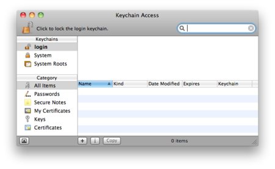

You can double click any of the items in the Keychain to view it's details and tick 'Show password:' to see the password associated with the item.

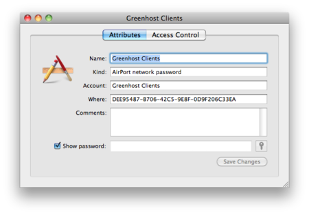

You will note that it will ask you for your master or login password to view the item.

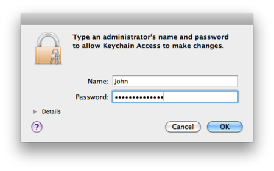

You can access modify any of the items and also use the Keychain to securely save any bits and pieces of text using the notes. To do this click on notes and than choose 'New secure Note item' from the file menu.
