VPN on Ubuntu
=============

If you use Ubuntu as your operating system, you can connect to a VPN by using the built-in *NetworkManager*. This application is able to set up networks with OpenVPN. PPTP should not be used for security reasons. Unfortunately at the time of writing a L2TP interface is not available in Ubuntu. (It can be done manually, but it goes beyond the scope of this document).

The following example will explain how to connect with an OpenVPN-server. Under all situations we assume you already have a VPN account as described earlier in this section.

Preparing Network Manager for VPN networks
------------------------------------------

For Ubuntu there is an excellent network utility: Network Manager. This is the same utility you use to set up your Wireless (or wired) network and is normally in the upper right corner of your screen (next to the clock). This tools is also capable of managing your VPNs, but before it can do so, it's necessary to install some extensions.

### Installing OpenVPN extension for Network Manager

To install the plugins for Network Manager we will use the Ubuntu Software Center.

 1. Open the Ubuntu Software Center by typing software in the Unity search bar

 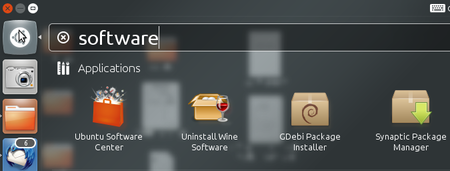

 2. The Ubuntu Software Center enables you to search, install and remove software on your computer. Click on the search box at the top right of the window.

 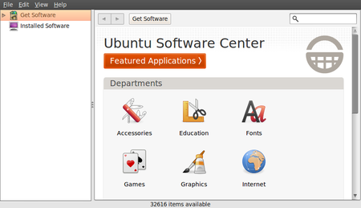

 3. In the search box, type in "network-manager-openvpn-gnome" (which is the extension that will enable OpenVPN). It's necessary to type the full names because the packages are classified as "technical" and don't pop-up earlier. These packages include all the files you need to establish a VPN connection successfully.

 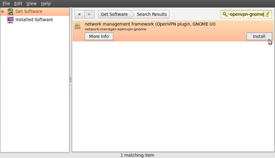

 4. Ubuntu may ask you for additional permissions to install the program. If that is the case, type in your password and click Authenticate. Once the package is installed, you can close the Software Center window.

 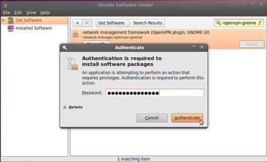

 5. To check if the extensions are correctly installed, click on the NetworkManager (the icon at the left of your system clock) and select VPN Connections > Configure VPN.

 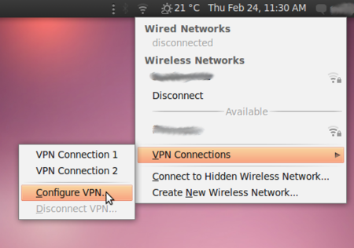

 6. Click Add under the VPN tab.

 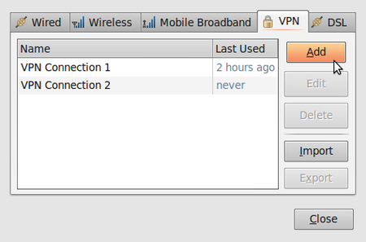

 7. If you see a pop-up asking for the type of VPN and the tunnel technology (OpenVPN) option is available, this means that you have installed the VPN extension in Ubuntu correctly. If you have your VPN login information ready, you can continue right away, else you first have to get a VPN account from a VPN-provider. If this is the case, click cancel to close the Network Manager.

 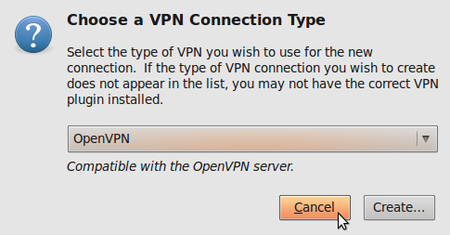

Configuring an OpenVPN network
------------------------------

Let us assume you have received your configuration files and credentials from your VPN provider. This information should contain the following

 * an *.ovpn file, ex. air.ovpn
 * The file: ca.crt (this file is specific for every OpenVPN provider)
 * The file: user.crt (this file is your personal certificate, used for encryption of data)
 * The file: user.key (this file contains your private key. It should be protected in a good manner. Losing this file will make your connection insecure)

In most cases your provider will send these files to you in a zip file. Some openvpn providers use username and password authentication which will not be covered.

 1. Unzip the file you have downloaded to a folder on your hard drive (for example "/home/[yourusername]/.vpn"). You should now have four files. The file "air.ovpn" is the configuration file that you need to import into NetworkManager.

 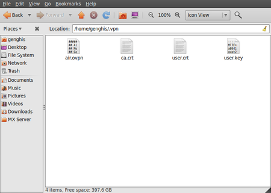

 2. To import the configuration file, open NetworkManager and go to VPN Connections > Configure VPN.

 

 3. Under the VPN tab, click Import.

 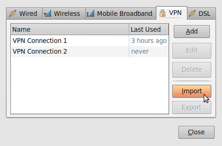

 4. Locate the file air.ovpn that you have just unzipped. Click Open.

 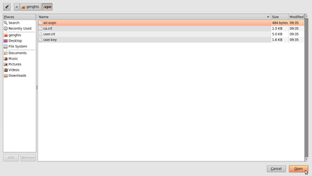

 5. A new window will open. Leave everything as it is and click Apply.

 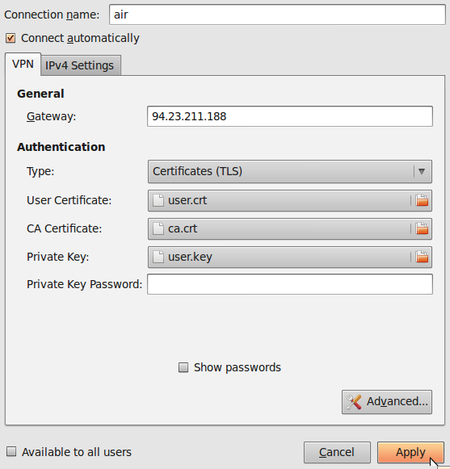

 6. Congratulations! Your VPN connection is ready to be used and should appear on the list of connections under the VPN tab. You can now close NetworkManager.

 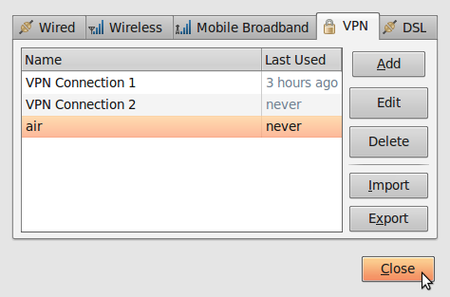

Using your new VPN connection
-----------------------------

Now that you configured NetworkManager to connect to a VPN service using the OpenVPN client, you can use your new VPN connection to circumvent Internet censorship. To get started, follow these steps:

 1. In the NetworkManager menu, select your new connection from VPN Connections.

 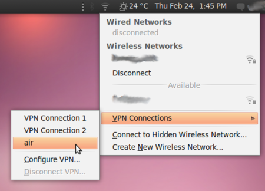

 2. Wait for the VPN connection to be established. When connected, a small padlock should appear right next to your NetworkManager icon, indicating that you are now using a secure connection. Move your cursor over the icon to confirm that the VPN connection is active.

 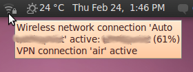

 3. Test your connection, using the method described in the "Make sure it works" section of this chapter.

 4. To disconnect from your VPN, select VPN Connections > Disconnect VPN in the NetworkManager menu. You are now using your normal connection again.

 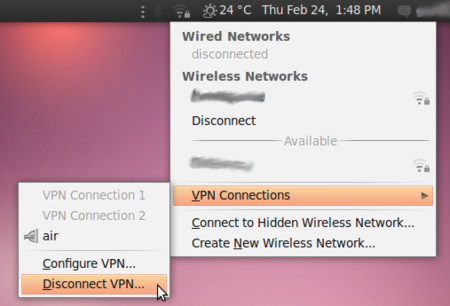

