VPN on MacOSX
=============

Setting up a VPN on MacOSX is very easy once you have your account details ready, Let's assume have your credentials from your VPN provider for L2TP/IPSec connection ready. This information should contain the following:

 * Username, ex. `bill2`
 * Password, ex. `verysecretpassword`
 * VPN server, ex. `tunnel.greenhost.nl`
 * A Pre-Shared-Key or Machine-certificate

Setup
-----

 1. Before getting started, please be sure you've read the paragraph "testing before and after account set up", this way you will be able to validate if your connection is actually working after set up.

 2. A VPN is configured in the network settings, that are accessible via "System Preferences.." in the Apple menu.

 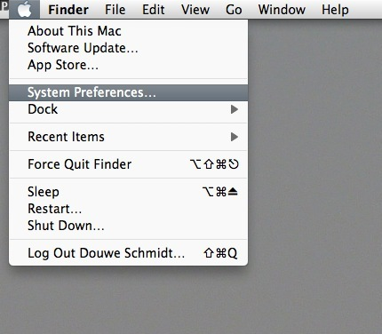

 3. Next, open the Network preferences.

 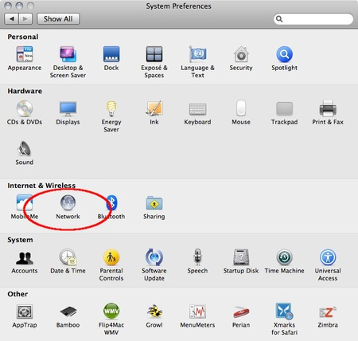

 4. OSX uses this nifty system to lock windows. To add a VPN it is necessary to unlock the screen: you can do this by clicking on the lock on the left bottom of the screen.

 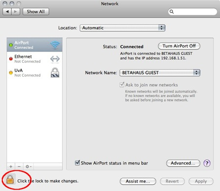

 5. Enter our user credentials

 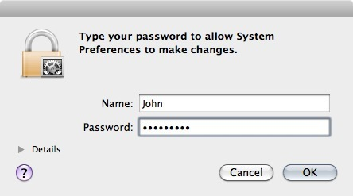

 6. Now we can add a new network. Do this by clicking on the "+" sign

 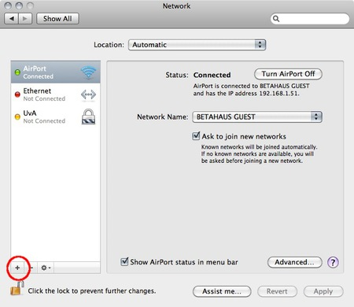

 7. In the pop-up you need to specify the type of connection. In this case choose an VPN interface with L2TP over IPSec. This is the most common system. Also don't forget to give the connection a nice name.

 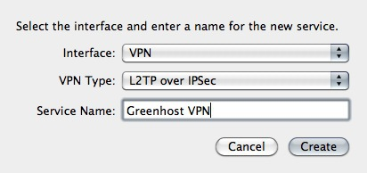

 8. Next comes the connection data. Please fill in the provided server name and user name (called 'Account Name'). If this is done, click on the "Authentication Settings..." button

 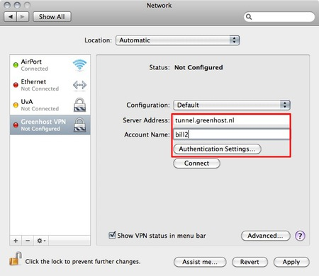

 9. In the new pop-up you can specify connection specific information. This is the way the user is authenticated and how the machine is authenticated. The user is very commonly authenticated by using a password, although other methods are possible. Machine authentication is often done by a Shared Secret (Pre-Shared-Key/PSK), but also quite often by using a certificate. In this case we use the Shared Secret method. When this is done click OK.

 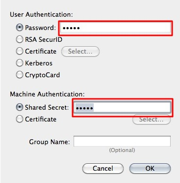

 10. Now you return back to the network screen. The next step is very important, so click on "Advanced..."

 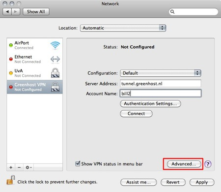

 11. In the new pop up you will see an option to route all traffic through the VPN connection. We want to enable this, so all our traffic is encrypted.

 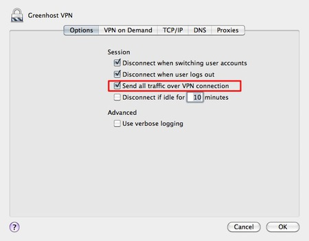

 12. Well, all is done. Now hit the Connect button!

 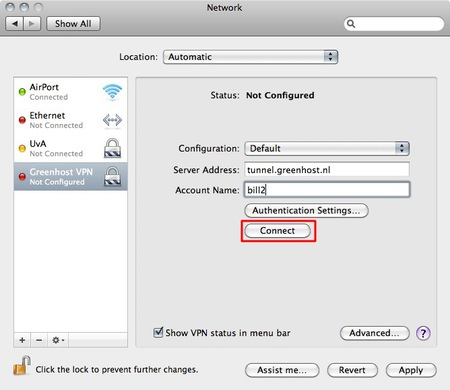

 13. A pop-up appears. You need to confirm your changes, just hit "Apply"

 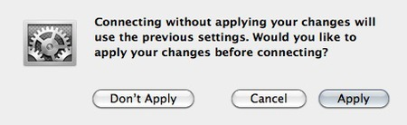

 14. After a few seconds, on the left side the connection should turn green. If so, you are connected!

 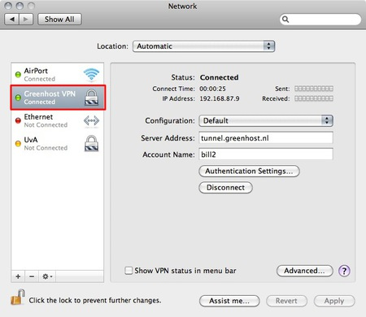

 15. Ok, now test your connection!

