VPN on Windows
==============

Setting up a VPN on Windows is very easy once you have your account details ready. Let's assume have your credentials from your VPN provider for L2TP/IPSec connection ready. This information should contain the following:

 * Username, ex. `bill2`
 * Password, ex. `verysecretpassword`
 * VPN server, ex. `tunnel.greenhost.nl`
 * A Pre-Shared-Key or Machine-certificate

Setup
----- 

 1. Before getting started, please be sure you've read the paragraph "testing before and after account set up", this way you will be able to validate if your connection is actually working after set up.

 2. We need to go to the "Network and Sharing Center" of Windows to create a new VPN connection. We can access this center easily by clicking on the network icon next to the systemclock en click on "open Network and Sharing Center"

 

 3. The "Network and Sharing Center" will popup. You will see some information about your current network. Click on "Connect to a network" to add a VPN connection.

 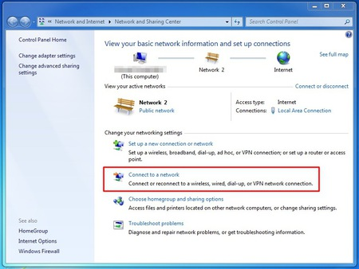

 4. The wizard to setup a connection will popup. Choose the option to "connect to a workplace", which is Microsoft's way of naming a VPN connection.

 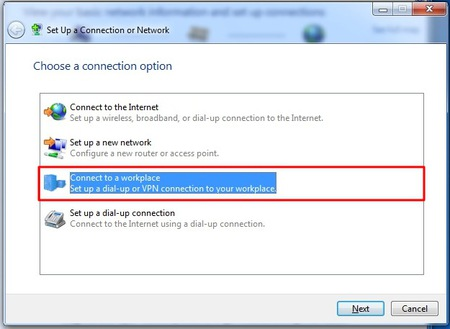

 5. The next screen asks us if we want to use our Internet connection or an old-school phone line to connect to the VPN. Just choose the first option then.

 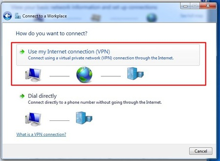

 6. The next screen asks for the connection details. Enter here the server of your VPN-provider (called "Internet address" in this dialog). On the bottom please check the box "Don't connect now; just set it up". Using this option the connection will be automatically saved and it's easier to control extra settings. If this is all done, hit the "next" button

 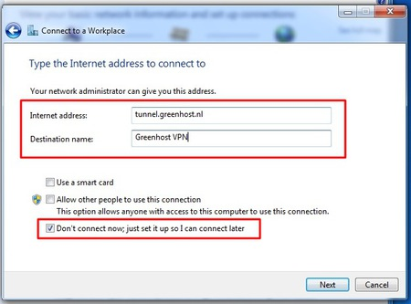

 7. Next up are your username and password. Just give them like you received them from your VPN-provider. If the connection fails, Windows forgets them. So keep them with you, you maybe need them later. If this is done. Click "create".

 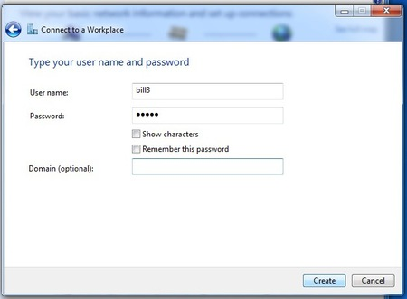

 8. Your connection is now available, if you click the the network icon again, you will see a new option in the network menu, the name of your VPN connection, just click it to connect.

 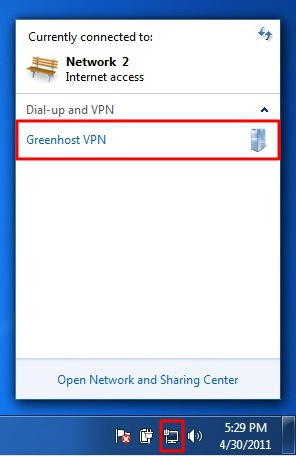

 9. And click "connect"

 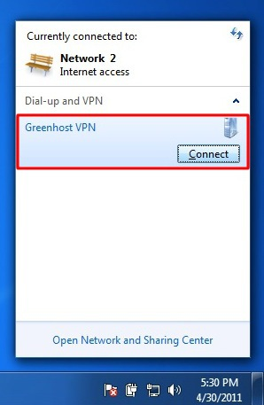

 10. A VPN connection dialog appears. This give us the opportunity to review our settings and to connect. You can try to connect, Windows will try to discover all other settings automatically. Unfortunately, this does not always work, so if this is not working for you, hit the "properties" button.

 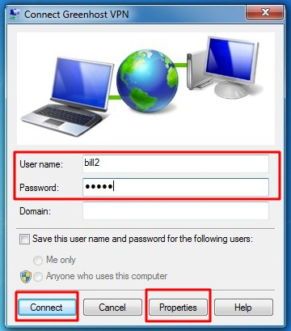

 11. The properties windows appear. The most important page is the "Security" page, click on the Security tab to open it.

 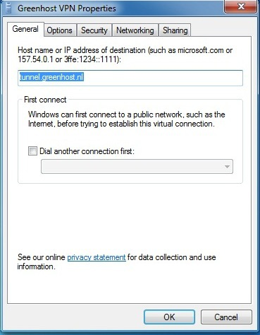

 12. In the security tab you can specify VPN type, normally L2TP/IPSec. Do not use PPTP as it has several security vulnerabilities. For L2TP/IPSec also have a look at the Advanced settings.

 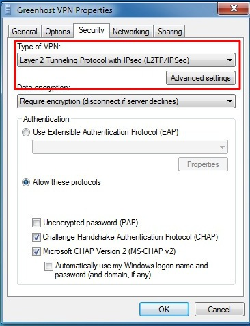

 13. In the Advanced Settings window, you can specify if you are using a pre-shared key or a certificate. This depends on your VPN-provider. If you have received a pre-shared-key, Select this option and fill in this key. Hit ok afterwards. You will return to the previous window, click ok there also

 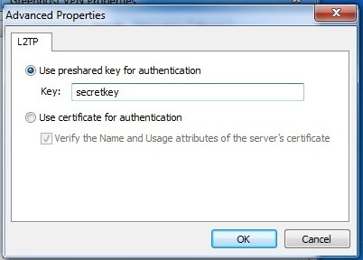

 14. Back in to connection window try to connect now. Please be sure your username and password are filled out.

 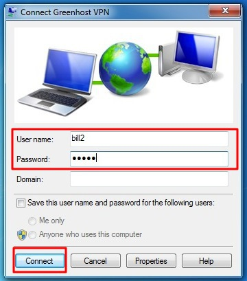

 15. A connection popup will appear

 

 16. Online! Don't forget to check if your VPN is working properly. 
