Using TrueCrypt
===============

The following are step-by-step instructions on how to create, mount, and use a TrueCrypt volume.

Creating a TrueCrypt Container
------------------------------

 1. Install TrueCrypt. Then launch TrueCrypt by

     * double-clicking the file TrueCrypt.exe in Windows
     * opening Applications->Accessories->TrueCrypt in Ubuntu
     * on MacOSX open it by clicking Go > Applications. Find TrueCrypt in the Applications folder and double click on it.

 2. When the main TrueCrypt window appears. Click Create Volume.

 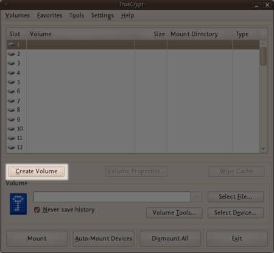

 3. You should see the TrueCrypt Volume Creation Wizard window appear on screen.

 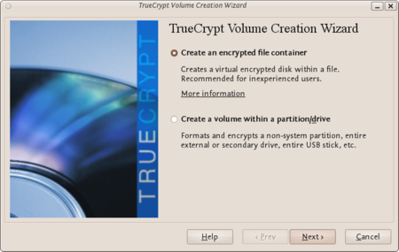
 
 Where do you want to create the TrueCrypt volume? You need to choose now. This can be in a file, which is also called a container, in a partition or drive. The following steps will take you through the first option creating a TrueCrypt volume within a file.

 You can just click Next, as the option is selected by default,

 4. Next you need to choose whether to create a standard or hidden TrueCrypt volume. We will walk you through the former option and create a standard TrueCrypt volume.

 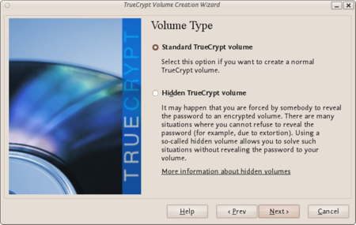
 
 You can just click Next, as the option is selected by default.

 5. Now you have to specify where to have the TrueCrypt volume (file container) created. Note that a TrueCrypt container behaves like any normal file. It can be moved or deleted as any normal file.

 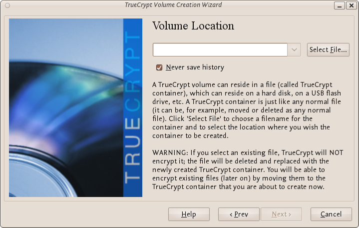

 Click Select File.

 The standard file selector will now appear on screen (the TrueCrypt Volume Creation Wizard remains open in the background). You need to browse to the folder that the file should be created in and then type into the 'name' field the name for the file you wish to create.

 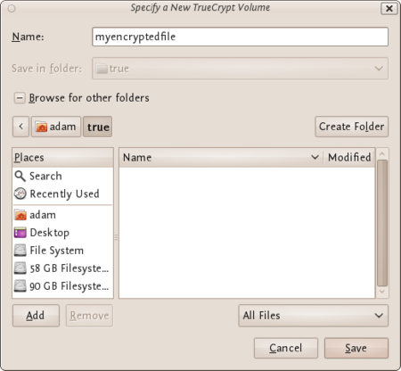
 
 We will create our TrueCrypt volume in the folder 'adam/true' and the filename of the volume (container) will be 'myencryptedfile'. You may, of course, choose any other filename and location you like (for example, on a USB stick). Note that the file 'myencryptedfile' does not exist yet - TrueCrypt will create it. Press 'Save' when you are ready. The file selector window should close.

 **IMPORTANT:** Note that TrueCrypt will not encrypt any existing files. If an existing file is selected in this step, it will be overwritten and replaced by the newly created volume (the contents of the existing file will be lost). You will be able to encrypt existing files later on by moving them to the TrueCrypt volume that we are creating now.

 6. In the Volume Creation Wizard window (which was previously running in the background), click Next.

 7. Here you can choose an encryption algorithm and a hash algorithm for the volume.

 

 The TrueCrypt manual suggests that if you are not sure what to select here, you can use the default settings and click Next (for more information about each setting have a look at the TrueCrypt documentation website).

 8. Now choose the size of your container. You should be fine with 1 megabyte but for this example we will enter '20' into the available field.

 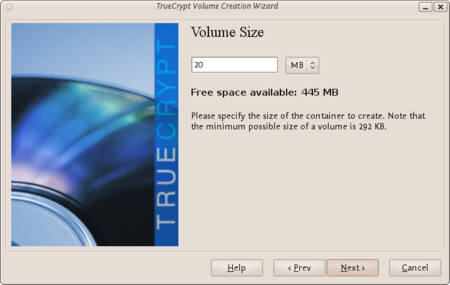

 You may, of course, specify a different size. After you type the desired size in the input field, click Next.

 9. This step is really important, choosing a password.

 The information displayed in the Wizard window about what is considered a good password, should be read carefully.

 Choose a strong password, type it in the first input field. Then re-type it in the input field below the first one.

 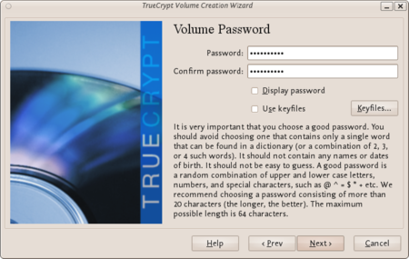

 When you are done click Next.

 10. Now you must choose the format of your partition (this step may not be available for you under windows or OSX). If using Ubuntu you can choose a Linux file type or FAT (Windows) for simplicity leave it at the default.

 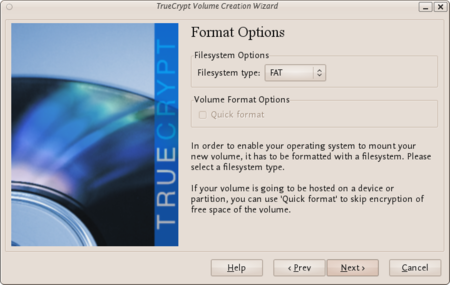

 Then press Next.

 11. Next TrueCrypt tries to generate random information to help encrypt your container. For 30 seconds move your mouse as randomly as possible within the Volume Creation Wizard window. Move the mouse as much as possible for up to a minute. This significantly increases security by increasing the cryptographic strength of the encryption keys. security). Move your mouse around until you are bored.

 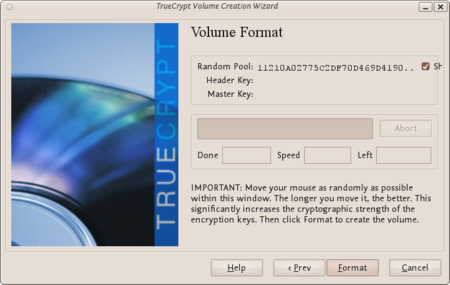

 Then Click Format.

 TrueCrypt will now create a file in the folder you selected with the name you chose. This file will be a TrueCrypt container, containing the encrypted TrueCrypt volume. This may take some time depending on the size of the volume. When it finishes this should appear:

 

 Click OK to close the dialog box.

 12. Well done! You've just successfully created a TrueCrypt volume (file container).

 In the TrueCrypt Volume Creation Wizard window, click Exit.

Mounting the Encrypted Volume
-----------------------------

 1. Open up TrueCrypt again.

 2. Make sure one of the 'Slots' is chosen (it doesn't matter which - you can leave at the default first item in the list). Click Select File.

 

 The standard file selector window should appear.

 3. In the file selector, browse to the container file (which we created earlier) and select it.

 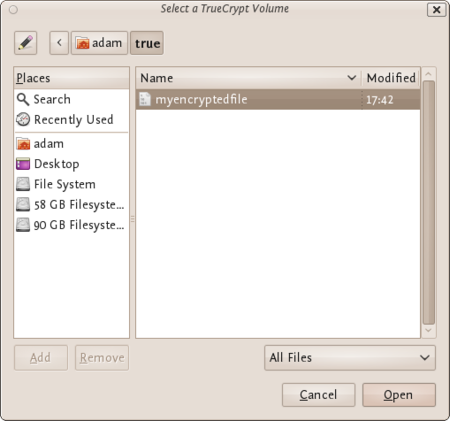

 Click Open (in the file selector window).

 The file selector window should disappear.

 4. In the main TrueCrypt window, click Mount.

 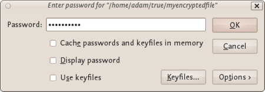

 Password prompt dialog window should appear.

 5. Type the password in the password input field.

 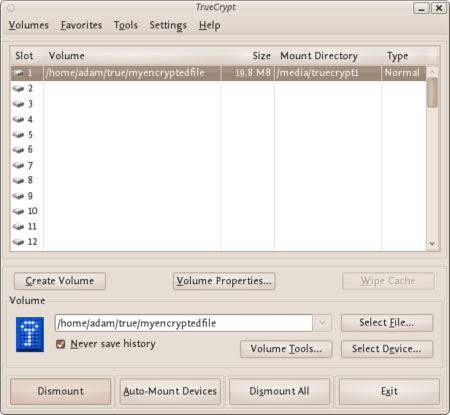

 6. Click OK in the password prompt window.

 TrueCrypt will now attempt to mount the volume. If the password is correct, the volume will be mounted.

 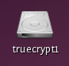

 If the password is incorrect (for example, if you typed it incorrectly), TrueCrypt will notify you and you will need to repeat the previous step (type the password again and click OK).

 7. We have just successfully mounted the container as a virtual disk 1. The container will appear on your Desktop or you will see it in your file browser.

What does this mean?
--------------------

The disk that you have just created is completely encrypted and behaves like a real disk. Saving (moving, copying, etc) files to this disk will allow you to encrypt files on the fly.

You'll be able to open a file which is stored on a TrueCrypt volume, which will automatically be decrypted to RAM while it is being read, and you won't need to enter your password each time. You'll only need to enter this when your mounting the volume.

Remember to dismount!
---------------------

To do this right click on the drive and select unmount. This will automatically happen when you turn off your computer but will not happen if you just put the computer on sleep.
