Securely destroying data
========================

Just hit the delete button and you are done! No it's not that easy. To understand how to securely delete data, we have to understand how data is stored. In an analogy to the real world, an explanation of how data is stored follows:

Assume you have a small notebook with 10 pages and you want to write some data in this notebook. You just start writing on the first page up to the end of the notebook. Maybe you decide the information on page 5 must be destroyed. Probably you will just take out the page and burn it.

Unfortunately data on a harddisk doesn't work this way. A harddisk contains not ten but thousands or maybe even millions of pages. Also it's impossible to take out a "page" of a harddisk and destroy it. To explain how a harddisk work, we will continue with our 10-page notebook example. But now we will work a little bit different with it. We will work in a way similar to how a harddisk works.

This time we use the first page of our notebook as an index. Assume we write a piece about "WikiLeaks", then on the first page we write a line "piece about WikiLeaks: see page 2". The actual piece is then written on page 2.

For the next document, a piece about "Goldman Sachs" we add a line on page 1, "Goldman Sachs: see page 3". We can continue this way till our notebook is full. Let's assume the first page will look like this:

 * WikiLeaks -> see page 2
 * Goldman Sachs -> see page 3
 * Monstanto scandal -> see page 4
 * Holiday pictures -> see page 5
 * KGB Investigation -> see page 6
 * Al Jazeeraa contacts -> see page 7
 * Iran nuclear program -> see page 8
 * Sudan investigation -> see page 9
 * Infiltration in EU-politics -> see page 10

Now, let's decide you want to wipe the "Goldman Sachs" piece, what a harddisk will do, it will only remove the entry on the first page, but not the actual data, your index will be:

 * WikiLeaks -> see page 2
 * Monstanto scandal -> see page 4
 * Holiday pictures -> see page 5
 * KGB Investigation -> see page 6
 * Al Jazeeraa contacts -> see page 7
 * Iran nuclear program -> see page 8
 * Sudan investigation -> see page 9
 * Infiltration in EU-politics -> see page 10

What we did, we removed only the reference to the article, but if we open page 3, we will still able to read the Goldman Sachs piece. This is exactly the way what a harddisk does when your "delete" a file. With specialized software it still able to "recover" page 3.

To securely delete data, we should do the following:

 1. Open the "Goldman Sachs" page (page 3)
 2. Use an eraser to remove the article there, if done return to page 1
 3. Delete the reference in the index on page 1

Well you will be surprised by the similarity between this example and the real world. You know when you removed the article on page 3 with an eraser, it is still possible to read the article slightly. The pencil leaves a track on the paper because of the pressure of the pencil on the paper and also you will be unable to erase all of the graphite. Small traces are left behind on the paper. If you really need this article, you can reconstruct (parts) of it, even if it's erased.

With a harddisk this is very similar. Even if you erased every piece of data, it is sometimes possible with (very) specialized hardware to recover pieces of the data. If the data is very confidential and must be erased with the greatest care, you can use software to "overwrite" all pieces of data with random data. When this is done multiple times, this will make the data untraceable.

A note on Solid State Hard Drives
---------------------------------

The instructions below explain how to use file deletion tools to securely delete files from your hard drives. These tools rely on the Operating System you are using being able to directly address every byte on the hard drive in order to tell the drive "set byte number X to 0". Unfortunately, due to a number of advanced technologies used by Solid State Drives (SSDs) such as TRIM, it is not always possible to ensure with 100% certainty that every part of a file on an SSD has been erased using the tools below.

Securely delete data under Windows
----------------------------------

For Windows there is a good open source tool called "File Shredder". This tool can be downloaded from http://www.fileshredder.org

The installation is very straightforward, just download the application and install it by hitting the next button. After installation this application will automatically start. You can then start using it for shredding files. However the best part of the program is that you can use it from within windows itself by right clicking on a file.

 1. Click right on the file you want to shred, and choose File Shredder -> Secure delete files

 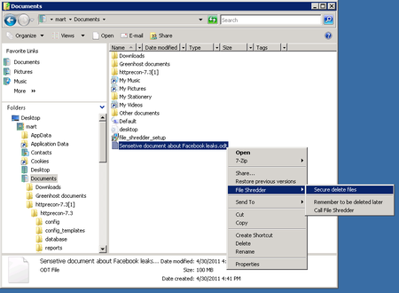

 2. A pop-up asks if you really want to shred this file

 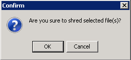

 3. After confirming, there your file goes. Depending on the size of the file this can take a while

 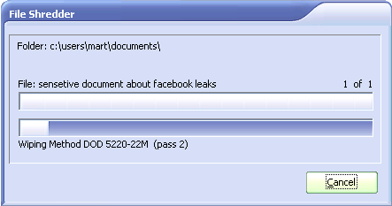

Securely delete data under MacOSX
---------------------------------

There are basically to build-in steps to make to securely delete your data on Mac OSX.

 1. Erase the free-space on your hard-drive containing all the data of items which are deleted in an insecure way.

 2. Make sure that every file from then on is always securely deleted.

We start with the first one:

### Erasing Free Space

 1. Open Disk-Utility which resides in the Utilities folder inside the Applications folder.

 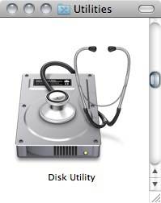

 2. Select your hard drive and click on 'Erase Free Space'.

 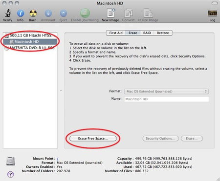

 3. Three options will appear, from top to bottom more secure, but also they take much more time to complete. Read the descriptions on each one of them to get an idea from what will happen if you use them and then choose which one might suite your needs the best and click 'Erase free Space'.

 If time is no issue, then use the most secure method and enjoy your free time to get a good coffee while you Mac crunches away on this task. If the crooks are already knocking on your front-door you might want to use the fastest way.

 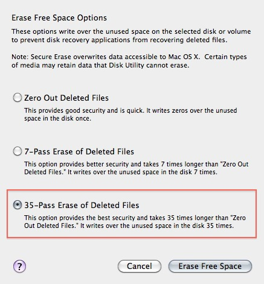

### Securely Erasing Files

Now that your previously deleted data is once and for ever securely erased you should make sure that you don't create any new data that might be recovered at a later date.

 1. To do this open the finder preferences under the Finder Menu.

 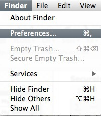

 2. Go to the advanced tab and tick 'Empty trash securely'. This will make sure that every time you empty your trash all the items in it will be securely deleted and are really gone!

 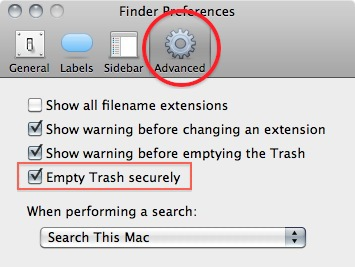

**Note:** Deleting your files securely will take longer then just deleting them. If you have to erase big portions of unimportant data (say your movie and mp3 collection) you may wanna untick this option before doing so.

Securely delete data under Ubuntu/Linux
---------------------------------------

Unfortunately currently there is no graphical user interface available for Ubuntu to delete files secure. There are two command-line programs available though:

 * shred
 * wipe

Shred is installed in Ubuntu by default and can delete single files. Wipe is not installed by default but can easily be installed with using Ubuntu Software Center or if you understand the command line you can install it with `apt-get install wipe`. Wipe is a little more secure and has nicer options.

It is possible make access to these program's easy by adding it as an extra menu option

 1. We assume you are familiar with the Ubuntu Software Center. To add the securely wipe option, it's required to install these two programs *wipe* and *nautilus-actions*

 If the two programs are installed follow the following steps. If they are not installed use the Ubuntu Software Center to install them or on the command line simply type apt-get install nautilus-actions wipe

 2. Open the "Nautilus Actions Configuration" from the System -> Preferences menu

 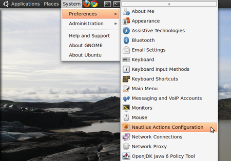

 3. We have to add a new action. To do this, start clicking on the "create new action button", the first option in the toolbar

 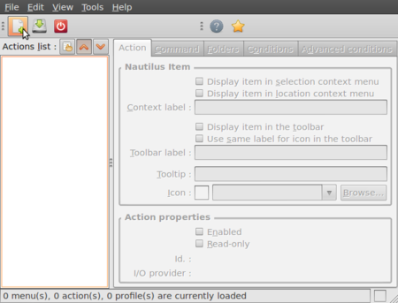

 4. Next is describing the new action. You can give the action every name you wish. Fill out this title in the "Context label" field. In this example we used "Delete file securely"

 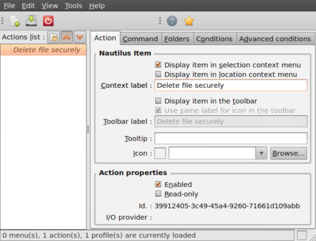

 5. Click on the second tab ("Command"), here is how we specify the action we want. In the field "Path", type "wipe", in the field parameters type "-rf %M", please be sure about the capitalisation of all characters here, this is very important.

 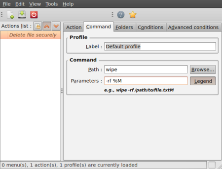

 6. Next is specifying the conditions, click on the conditions tab and choose the option "Both" in the "Appears if selection contains..." box. With this option you can wipe both files and folders securely. If done, click the save button (second item on the icon bottom toolbar) or use the menu File->Save

 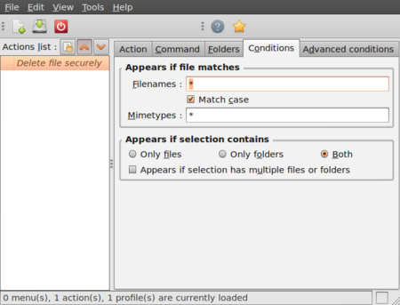

 7. Now close the Nautilus Actions Configuration tool. Unfortunately, after this, you have to re-login into your system, so ether reboot or logout/login.

 8. Now browse to the file you want to securely delete and right click:

 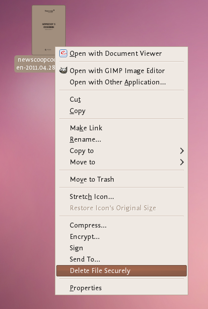

 Choose 'Delete File Securely'. The file will then be wiped 'quietly' - you do not get any feedback or notice that the process has started or stopped. However the process is underway. It takes some time to securely delete data and the bigger the file the longer it takes. When it is complete the icon for the file to be wiped will disappear. If you would like to add some feedback you can change the parameters field in Nautilius Actions Configuration tool to this:

 `-rf %M | zenity --info --text "your wipe is underway, please be patient. The file to be wiped will disappear shortly."`

 The above line will tell you the process is underway but you will not know the file is deleted until the icon disappears. 
