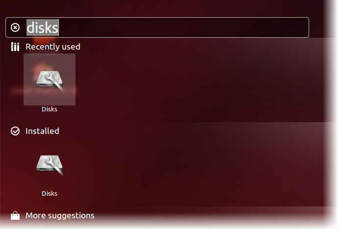
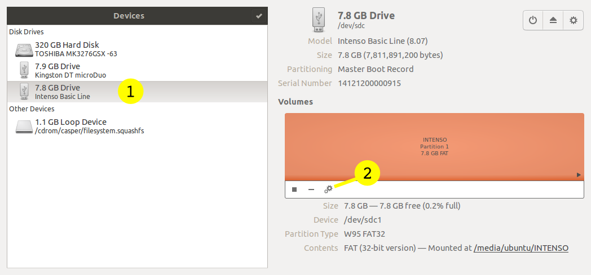
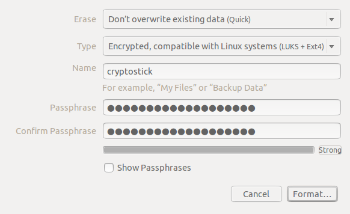
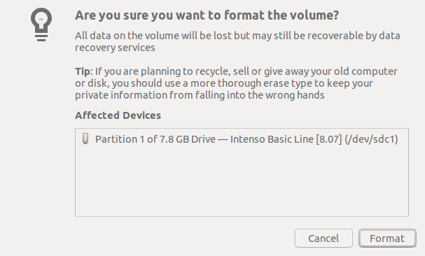
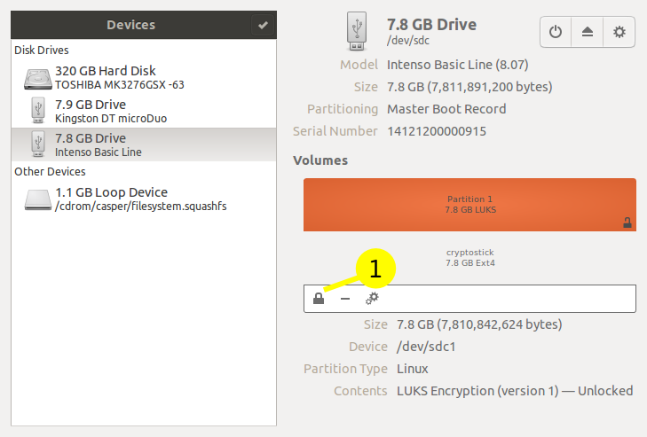
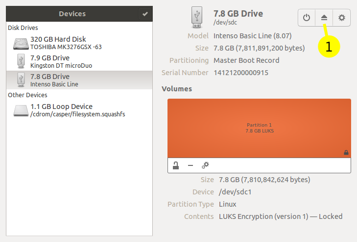
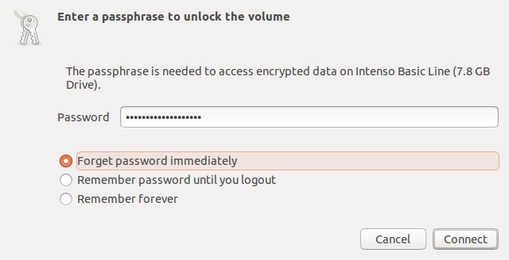

About LUKS
==========

 **LUKS**, short for *Linux Unified Key Setup*, is the default method for disk encryption on Linux. It can be used to enable *Full Disk Encryption* during installation with a single click, or to encrypt individual partitions on external hard disks or usb sticks later on. Please note that *Full Disk Encryption* is hard to enable **after** the installation as it requires moving all existing files temporarily as encrypting a device requires formatting it.

 * Advantages: LUKS is available through dm-crypt which is part of the Linux kernel, so it doesn't need any further software to be installed.

 * Disadvantages: Unlike with Truecrypt, it is not possible to use it with other Operating Systems (yet), so if you use LUKS to encrypt a USB drive, you can only use it on Linux machines, but not on Windows or Mac OS.

If you want to encrypt a device after the Linux installation completed, you can use the *Disks* utility which can be found in most Linux distribution's *System Settings*.

## Starting *Disks*

On Ubuntu, start *Disks* by pressing the Windows key and A, typing "disks" and selecting the corresponding program as shown below:

## Encrypting a device

On the left hand side you will find a list of all storage devices plugged into your computer.

Select the one you want to encrypt (step 1) (in this case a usb stick), and then on the right hand side, click on the cog wheels and "Format…". A dialog will appear where you can select if the existing data on the device shall be completely overwritten (that can take up to several hours depending on the size and performance of the device) or just formatted. Please note that even if you choose to encrypt the device, data, that was present before will be recoverable if you don't choose to overwrite it completely.

No matter what you choose for the field *Erase*, select "Encrypted, compatible with Linux systems (LUKS+Ext4)" for *Type*, give it a name and a strong passphrase (see chapter 8 on that matter), and click *Format…*

On the confirmation screen make sure you selected the correct device as data recovery is a cumbersome tasks – if possible at all.

Back on the main window the device now consists of two layers. One is the physical storage (here called "Partition 1") and the other a virtual device which is created by the LUKS system to give you access to the encrypted device (here called "cryptostick"). The pad lock on "Partition 1" is open as the *Disks* utility needed to open it in order to create a file system (how would you store files on a device without a file system?). You can click on the (other) pad lock as shown below to close the decryption channel and the *eject* button in the upper right corner to safely remove the device.

## Using an encrypted device

This is quite straight-forward. Plug it in, enter the passphrase and click *Connect*. If the file manager does not open automatically, the device will be available when you do.

