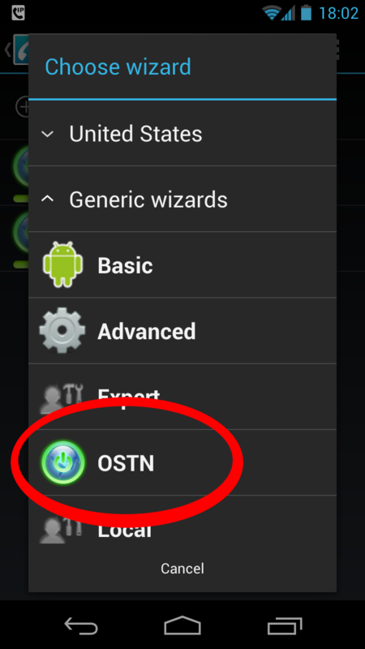
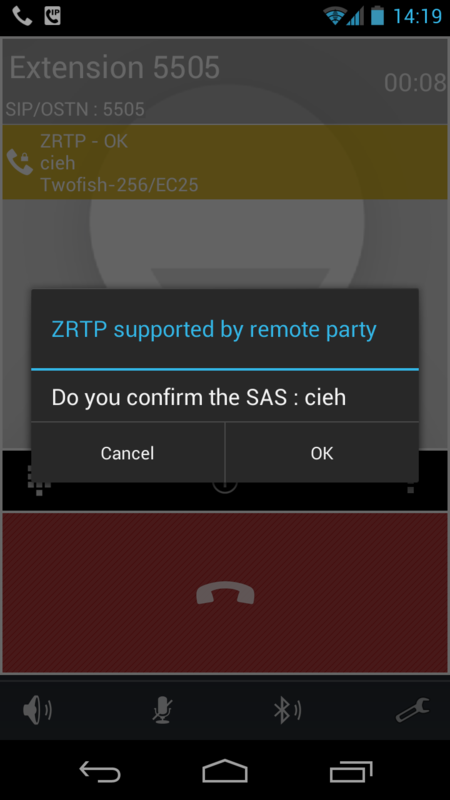

Installing CSipSimple
=====================

CSipSimple is a program for Android devices that allows for making encrypted calls. Naturally the calling software isn't enough on its own and we need a communication network to enable us to make calls.

Introducing The OSTN Network
----------------------------

If you already know about OSTN and have an account, you can skip this section.

The Guardian Project's OSTN (Open {Secure, Source, Standards} Telephony Network - [https://guardianproject.info/wiki/OSTN](https://guardianproject.info/wiki/OSTN)) is an attempt to define a standard Voice over IP (VoIP) setup using the Session Initiation Protocol (SIP) that enables end-to-end encrypted calls. Similar to e-mail, SIP allows people to choose their service provider while still being able to call each other even if they are not using the same provider. Yet, not all SIP providers offer OSTN and both providers have to support OSTN for the call to be secure. Once a connection between two people is established, the audio data is exchanged directly between the two parties. Data is encrypted according to the Secure Real-time Transport Protocol (SRTP).

A majority of encrypting VoIP applications currently use Session Description Protocol Security Descriptions for Media Streams (SDES) with hop-by-hop Transport Layer Security (TLS) to exchange secret master keys for SRTP. This method is not end-to-end secure as the SRTP keys are visible in plaintext to any SIP proxy or provider involved in the call.

ZRTP is a cryptographic key-agreement protocol to negotiate the keys for encryption between two parties. ZRTP end points use the media stream rather than the signaling stream to establish the SRTP encryption keys. Since the media stream is a direct connection between the calling parties, there is no way for the SIP providers or proxies to intercept the SRTP keys. ZRTP provides a useful reassurance to end-users that they have a secure line. By reading and comparing a word pair, users can be certain that the key exchange has completed.

Open Secure Telephony (https://ostel.me/) is a testbed for OSTN that worked well at the time of writing this book. At https://ostel.me/users/sign_up you can sign up and create an account. You can also check the OSTN page listed above for other providers.

CSipSimple
----------

CSipSimple is a free and open source client for Android that works well with OSTN. You can find it at [https://market.android.com/details?id=com.csipsimple](https://market.android.com/details?id=com.csipsimple)

To use CSipSimple with ostel.me, select OSTN in the generic wizards when creating an account and enter username, password and server as provided after signing up at [https://ostel.me/users/sign_up](https://ostel.me/users/sign_up)

Once you call another party with CSipSimple you see a yellow bar with ZRTP and the verification word pair. You now have established a secure voice connection that cannot be intercepted. Still, you should be aware that your phone or the phone of the other party could be set up to record the conversation.

Basic steps:

 1. Install CSipSimple from Google Play store or other trusted source
 2. Start it up and choose if you want to make SIP calls via data connection or only WiFi
 3. Configure your account

To use CSipSimple with ostel.me, select OSTN in the Generic Wizards section when creating an account. You can toggle off the "United States" providers by clicking on "United States". Now select *OSTN*:

Now you can enter your username (number), password and server (ostel.me) as provided after signing up at [https://ostel.me/users/sign_up](https://ostel.me/users/sign_up).

Now you can make a call. The first time you connect to someone with ZRTP you have to verify that the key exchange was successful. In the example below the confirmation word is "cieh", you can already talk to the other party and make sure you both see the same word. Once done, press ok.

You now have established a secure voice connection that cannot be intercepted. Beware that your or the phone of the other party could be recording your conversation.
