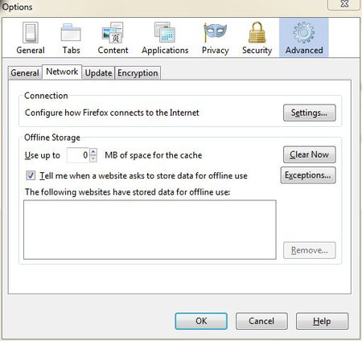

Installing I2P on Ubuntu Lucid Lynx (and newer) and derivatives like Linux Mint & Trisquel
===========================================================================================

 1. Open a terminal and enter:
    
 `sudo apt-add-repository ppa:i2p-maintainers/i2p`
 
 This command will add the PPA to /etc/apt/sources.list.d and fetch the gpg key that the repository has been signed with. The GPG key ensures that the packages have not been tampered with since being built.

 2. Notify your package manager of the new PPA by entering

 `sudo apt-get update`

 This command will retrieve the latest list of software from each repository that is enabled on your system, including the I2P PPA that was added with the earlier command.
 
 3. You are now ready to install I2P!

 `sudo apt-get install i2p`
 
 4. Your browse should open up with your local I2P router console, to browse i2p domains you have to configure your browser to use the i2p proxy. Also check your connection status on the left side on the router console. If your status is **Network: Firewalled** your connection will be rather slow. The first time you start I2P it may take a few minutes to integrate you into the network and find additional peers to optimize your integration, so please be patient.

From the Tools menu, select Options to bring up the Firefox settings panel. Click the icon labelled Advanced, then click on the Network tab. In the Connections section, click on the Settings button. You'll see a Window like the following:

In the Connection Settings window, click the circle next to Manual proxy configuration, then enter 127.0.0.1, port 4444 in the HTTP Proxy field. Enter 127.0.0.1, port 4445 in the SSL Proxy field. Be sure to enter localhost and 127.0.0.1 into the "No Proxy for" box.

For more information and proxy settings for other browsers check [https://www.i2p2.de/htproxyports.htm](https://www.i2p2.de/htproxyports.htm)

Instructions for Debian Lenny and newer
=======================================
For more information visit this page [https://www.i2p2.de/debian.html](https://www.i2p2.de/debian.html)

Starting I2P
============
Using these I2P packages the I2P router can be started in the following three ways:

* "on demand" using the i2prouter script. Simply run "i2prouter start" from a command prompt. (Note: Do not use sudo or run it as root!).
* as a service that automatically runs when your system boots, even before logging in. The service can be enabled with "dpkg-reconfigure i2p" as root or using sudo. This is the recommended means of operation.

