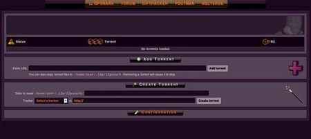

Anonymous Bittorrent with I2PSnark
==================================

We can use the I2P network to share and download files without the entire world knowing who is sharing them. or even the fact that you are running a torrent client, since i2p network is end-to-end encrypted the only thing known to outsider is you are running I2P.

I2p come with a built-in torrent client that run inside the browser called I2PSnark. You can access it through
this direct link:

[http://localhost:7657/i2psnark/](http://localhost:7657/i2psnark/)

or through the router console: [http://localhost:7657/](http://localhost:7657/) and clicking on the torrent icon. Once started you should see a screen similar to the following:

You can search for a torrent using one of following bittorrent trackers: 

* [http://tracker.postman.i2p/](http://tracker.postman.i2p/)

* [http://diftracker.i2p/](http://diftracker.i2p/)

Copy the torrent or magnet link and past it in the I2PSnark window, and click **Add torrent**.
the file will be downloaded inside the **/home/user/.i2p/i2psnark** folder.

**NOTE:**

* Since I2P is a closed network, you can't download normal torrents found on regular internet with it, and it can't be used to make downloading them anonymous!

* The speed seems to be slightly lower than usual which is caused by the anonymization. I think that the download rates are still acceptable if you consider that you download and share anonymously.
