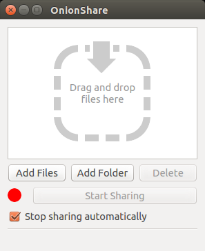
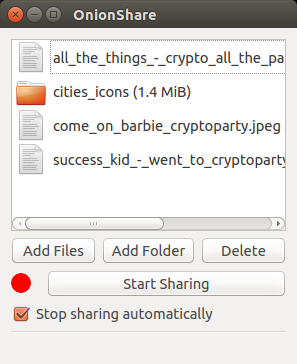
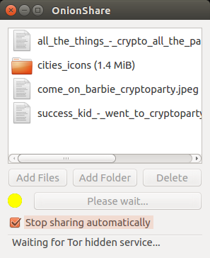
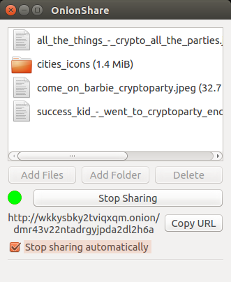
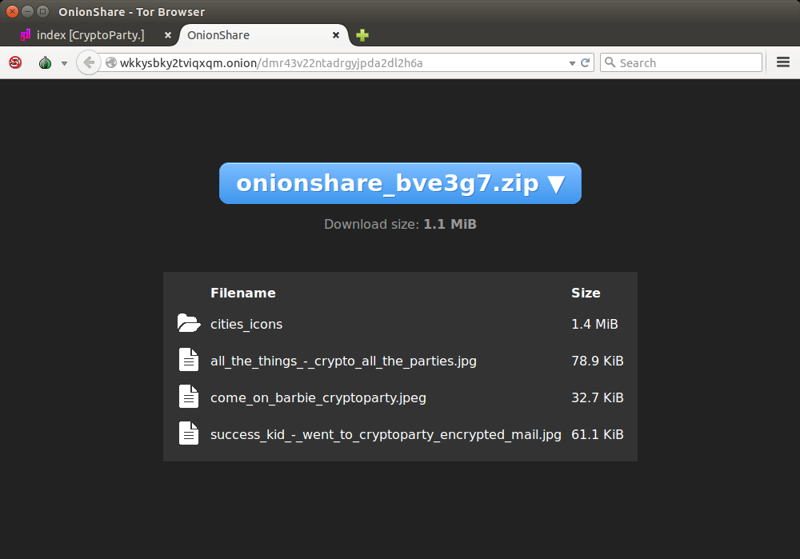
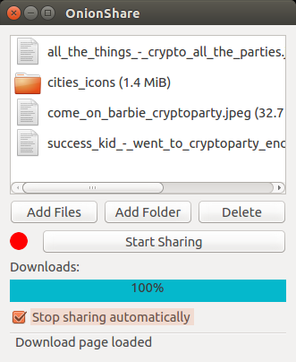
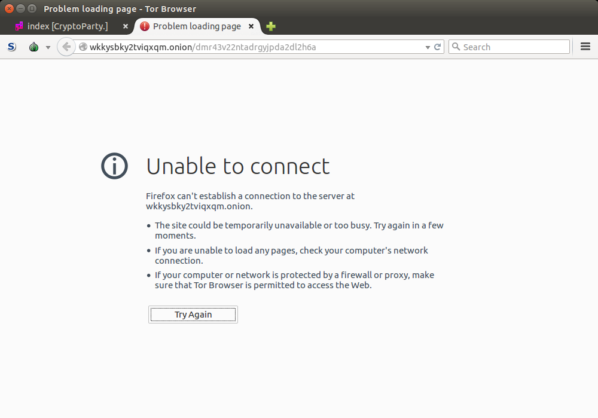

# OnionShare

## Introduction

What [OnionShare](https://onionshare.org/) is described the project's own words (quote from <https://github.com/micahflee/onionshare/blob/master/README.md>):

> [OnionShare](https://onionshare.org/) lets you securely and anonymously share files of any size. It works by starting a web server, making it accessible as a Tor hidden service, and generating an unguessable URL to access and download the files. It doesn't require setting up a server on the internet somewhere or using a third party filesharing service. You host the file on your own computer and use a Tor hidden service to make it temporarily accessible over the internet. The other user just needs to use [Tor Browser](https://www.torproject.org/download/download-easy.html.en) to download the file from you.

## Installation

Installation instructions are provided on the [OnionShare](https://onionshare.org/) website.

## Using OnionShare

This is what [OnionShare](https://onionshare.org) looks like when you start it.

You can share as many files and folders as you like. To add them you can use the related buttons or drag&drop files and folders into the window.
Please note the `Stop sharing automatically` checkbox. This ensures the files you share can be downloaded exactly once. 

Clicking on the `Start Sharing` button a small webserver starts in the background. It makes the files available to your friend but only through the [Tor](https://torproject.org) network because the small webserver is a so called [hidden service](https://tor.eff.org/docs/hidden-services.html.en).
Starting the hidden service might take a bit so please be patient.

Once the hidden service has started copy it's url through the `Copy URL` button.
You now send this address to your friend (through an encrypted channel if necessary).

After receiving the address your friend opens it in their [TorBrowser](https://www.torproject.org/download/download-easy.html.en). It will not work in other browsers.
Your friend sees a link to a zip file and a list of files contained within. Clicking on the big blue button the download is started.

You can see when your friend downloads the files through the blue progress bar. Once everything has been uploaded from your computer [OnionShare](https://onionshare.org) stops sharing automatically (unless you unchecked the `Stop sharing automatically` button).

To verify that [OnionShare](https://onionshare.org) really stopped sharing your files you can open the address you sent to your friend in your own [TorBrowser](https://www.torproject.org/download/download-easy.html.en). The download is no longer available.

