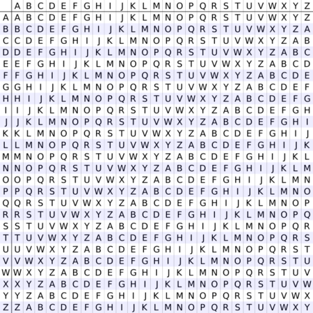

Cryptography and Encryption
===========================

Cryptography and encryption are similar terms, the former being the science and latter the implementation of it. The history of the subject can be traced back to ancient civilisations, when the first humans began to organise themselves into groups. This was driven in part by the realisation that we were in competition for resources and tribal organisation, warfare and so forth were necessary, so as to keep on top of the heap. In this respect cryptography and encryption are rooted in warfare, progression and resource management, where it was necessary to send secret messages to each other without the enemy deciphering ones moves.

Writing is actually one of the earliest forms of cryptography as not everyone could read. The word cryptography stems from the Greek words kryptos (hidden) and graphein (writing). In this respect cryptography and encryption in their simplest form refer to the writing of hidden messages, which require a system or rule to decode and read them. Essentially this enables you to protect your privacy by scrambling information in a way that it is only recoverable with certain knowledge (passwords or passphrases) or possession (a key).

Put in another way, encryption is the translation of information written in plaintext into a non-readable form (ciphertext) using algorithmic schemes (ciphers). The goal is to use the right key to unlock the ciphertext and return it back into its original plain text form so it becomes readable again.

Although most encryption methods refer to written word, during World War Two, the US military used Navajo Indians, who traveled between camps sending messages in their native tongue. The reason the army used the Navajo tribe was to protect the information they were sending from the Japanese troops, who famously could not decipher the Navajo's spoken language. This is a very simple example of using a language to send messages that you do not want people to listen into or know what you're discussing. 
Why is encryption important?
----------------------------

Computer and telecommunication networks store digital echoes or footprints of our thoughts and records of personal lives.

From banking, to booking, to socialising: we submit a variety of detailed, personalised information, which is driving new modes of business, social interaction and behavior. We have now become accustomed to giving away what was (and still is) considered private information in exchange for what is presented as more personalised and tailored services, which might meet our needs, but cater to our greed.

But how do we protect who sees, controls and uses this information?

Lets consider a scenario whereby we all thought it was fine to send all our communication on open handwritten postcards. From conversations with your doctor, to intimate moments with our lovers, to legal discussions you may have with lawyers or accountants. It’s unlikely that we would want all people to be able to read such communications. So instead we have written letters in sealed envelopes, tracking methods for sending post, closed offices and confidential agreements, which help to keep such communication private. However given the shift in how we communicate, much more of this type of interaction is taking place online. More importantly it is taking place through online spaces, which are not private by default and open to people with little technical skills to snoop into the matters that can mean the most to our lives. 

Online privacy and encryption is something we therefore need to be aware of and practice daily. In the same way we would put an important letter into an envelope or have a conversation behind a closed door. Given that so much of our private communication is now happening in networked and online spaces, we should consider the interface, like envelopes or seals, which protect this material as a basic necessity and human right.

Encryption examples
-------------------

Throughout history we can find examples of cipher methods, which have been used to keep messages private and secret.

A Warning!
----------

 > "There are two kinds of cryptography in this world: cryptography that will stop your kid sister from reading your files, and cryptography that will stop major governments from reading your files"  - Bruce Schneier, Applied Cryptography, 1996 

This chapter first explains a number of historical cryptographic systems and then provides a summary of modern techniques. The historical examples illustrate how cryptography emerged, but are considered broken in the face of modern computers. They can be fun to learn, but please don't use them for anything sensitive!

Historical ciphers
------------------

Classical ciphers refer to historical ciphers, which are now out of popular use or no longer applicable. There are two general categories of classical ciphers: transposition and substitution ciphers.

In a transposition cipher, the letters themselves are kept unchanged, but the order within the message is scrambled according to some well-defined scheme. An example of a transposition cipher is Skytale, which was used in ancient Rome and Greece. A paperstrip was wrapped around a stick and the message written across it. That way the message could not be read unless wound around a stick of similar diameter again.

*Image: Skytale taken from Wikimedia Commons (3.10.12)*

A substitution cipher is a form of classical cipher whereby letters or groups of letters are systematically replaced throughout the message for other letters (or groups of letters). Substitution ciphers are divided into monoalphabetic and polyalphabetic substitutions. The Caesar Shift cipher is common example of amonoalphabetic substitution ciphers, where the letters in the alphabet are shifted in one direction or another.

*Image: Caesar Shift Cipher taken from Wikimedia Commons (3.10.12)*

Polyalphabetic substitutions are more complex than substitution ciphers as they use more than one alphabet and rotate them. For example, The Alberti cipher, which was the first polyalphabetic cipher was created by Leon Battista Alberti, a 15th century Italian, Renaissance polymath and humanist who is also credited as the godfather of western cryptography. His cipher is similar to the Vigenère cipher, where every letter of the alphabet gets a unique number (e.g. 1-26). The message is then encrypted by writing down the message along with the password repeatedly written beneath it.

In the Vigenère cipher the corresponding numbers of the letters of message and key are summed up (with numbers exceeding the alphabet being dragged around the back) making the message so unreadable that it couldn't be deciphered for centuries (nowadays, with the help of computers, this obviously isn't true anymore).

*Image: Vigenère cipher taken from Wikimedia Commons (3.10.12)*

During World War 2 there was a surge in crypography, which lead to the development of new algorithms such as the one-time pad (OTP). The OTP algorithm combines plaintext with a random key that is as long as the plaintext so that each character is only used once. To use it you need two copies of the pad, which are kept by each user and exchanged via a secure channel.  Once the message is encoded with the pad, the pad is destroyed and the encoded message is sent. On the recipient's side, the encoded message has a duplicate copy of the pad from which the plaintext message is generated. A good way to look at OTP is to think of it as a 100% noise source, which is used to mask the message. Since both parties of the communication have copies of the noise source they are the only people who can filter it out.

OTP lies behind modern day stream ciphers, which are explained below. Claude Shannon, (a key player in modern cryptography and information theory), in his seminal 1949 paper "Communication Theory of Secrecy Systems" demonstrated that theoretically all unbreakable ciphers should include the OTP encryption, which if used correctly are impossible to crack. 

Modern ciphers
--------------

Post the World Wars the field of cryptography became less of a public service and fell more within the domain of governance. Major advances in the field began to reemerge in the mid-1970s with the advent of personalised computers and the introduction of the Data Encryption Standard (DES, developed at IBM in 1977 and later adopted by the U.S government). Since 2001 we now use the AES, Advanced Encryption Standard), which is based on symmetric cryptography forms.

Contemporary cryptography can be generally divided into what is called symmetric, asymmetric and quantum cryptography. 

Symmetric cryptography, or secret key, cryptography refers to ciphers where the same key is used to both encrypt and decrypt the text or information involved. In this class of ciphers the key is shared and kept secret within a restricted group and therefore it is not possible to view the encrypted information without having the key. A simple analogy to secret key cryptography is having access to a community garden, which has one key to open gate, which is shared by the community. You cannot open the gate, unless you have the key. Obviously the issue here with the garden key and with symmetric cryptography is if the key falls into the wrong hands, then an intruder or attacker can get in and the security of the garden, or the data or information is compromised. Consequently one of the main issues with this form of cryptography is the issue of key management. As a result this method is best employed within single-user contexts or small group environments.

Despite this limitation symmetric key methods are considerably faster than asymmetric methods and so are the preferred mechanism for encrypting large chunks of text.

Symmetric ciphers are usually implemented using **block ciphers** or **stream ciphers**. 

Block ciphers work by looking at the input data in 8 or 16 or 32 byte blocks at a time and spreading the input and key within those blocks. Different modes of operation are performed on the data in order to transform and spread the data between blocks. Such ciphers use a secret key to convert a fixed block of plain text into cipher text. The same key is then used to decrypt the cipher text. 

In comparison stream ciphers (also known as state cipher) work on each plaintext digit by creating a corresponding keystream which forms the ciphertext. The keystream refers to a stream of random characters (bits, bytes, numbers or letters) on which various additive or subtractive functions are performed and combined to a character in the plaintext message, which then produces the ciphertext. Although this method is very secure, it is not always practical, since the key of the same length as the message needs to be transmitted in some secure way so that receiver can decypher the message. Another limitation is that the key can only be used once and then its discarded. Although this can mean almost watertight security, it does limit the use of the cipher.

Asymmetric ciphers work much more complex mathematical problems with back doors, enabling faster solutions on smaller, highly important pieces of data. They also work on fixed data sizes, typically 1024-2048 bits and and 384 bits. What makes them special is that they help solve some of the issues with key distribution by allocating one public and one private pair per person, so that everyone just needs to know everyone else's public portion. Asymmetric ciphers are also used for digital signatures. Where as symmetric ciphers are generally used for message authenticity. Symmetric ciphers cannot non-repudiation signatures (i.e., signatures that you cannot later deny that you did not sign). Digital signatures are very important in modern day cryptography. They are similar to wax seals in that they verify who the message is from and like seals are unique to that person. Digital signatures are one of the methods used within public key systems, which have transformed the field of cryptography are central to modern day Internet security and online transactions.

Quantum Cryptography
--------------------

Quantum cryptography is the term used to describe the type of cryptography that is now necessary to deal with the speed at which we now process information and the related security measures that are necessary. Essentially it deals with how we use quantum communication to securely exchange a key and its associated distribution. As the machines we use become faster the possible combinations of public-key encryption and digital signatures becomes easier to break and quantum cryptography deals with the types of algorithms that are necessary to keep pace with more advanced networks.

Challenges & Implications
-------------------------

At the heart of cryptography lies the challenge of how we use and communicate information. The above methods describe how we encrypt written communication but obviously as shown in the Navajo example other forms of communication (speech, sound, image etc) can also be encrypted using different methods.

The main goal and skill of encryption is to apply the right methods to support trustworthy communication. This is achieved by understanding the tradeoffs, strengths and weaknesses of different cipher methods and how they relate to the level of security and privacy required. Getting this right depends on the task and context.

Importantly when we speak about communication, we are speaking about trust. Traditionally cryptography dealt with the hypothetical scenarios, where the challenge was to address how 'Bob' could speak to 'Alice' in a private and secure manner.

Our lives are now heavily mediated via computers and the Internet. So the boundaries between Bob, Alice + the 'other' (Eve, Oscar, Big Brother, your boss, ex-boyfriend or the government) are a lot more blurred. Given the quantum leaps in computer processing, in order for 'us', Bob's and Alice's to have trust in the system, we need to know who we are talking too, we need to know who is listening and importantly who has the potential to eavesdrop. What becomes important is how we navigate this complexity and feel in control and secure, so that you can engage and communicate in a trustful manner, which respects our individual freedoms and privacy.
